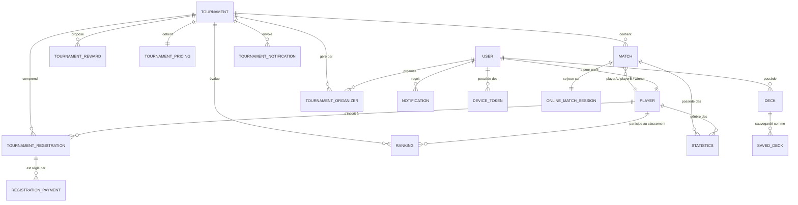

Cette section documente le modèle physique de données (schéma PostgreSQL via TypeORM) de **TCG Nexus**. Elle présente les entités majeures du système, leurs relations ainsi qu'un diagramme conceptuel complet.

## Diagramme entité-association (ERD)

Le diagramme ci-dessous illustre l'organisation globale de la base de données et les dépendances entre les différents modules applicatifs (Utilisateurs, Decks, Tournois, Matchs, Récompenses/Social).

---

## Liste des entités majeures

### 1. Utilisateurs et Joueurs (`User` / `Player`)

- **`User`** : Gère l'authentification et les métadonnées de base (email, mot de passe hashé, prénom, nom, rôle système : `ADMIN`, `MODERATOR`, `USER`).
- **`Player`** : Profil public de joueur. Il contient le score d'expérience (`xp`), le niveau (`level`), le score d'appariement (`elo`), et pointe vers un compte `User` via une relation `@OneToOne`.

### 2. Tournois (`Tournament` et associés)

- **`Tournament`** : Stocke les détails d'un tournoi (nom, description, dates de début/fin, format de jeu, statut : `draft`, `registration_open`, `registration_closed`, `in_progress`, `finished`, `cancelled`).
- **`TournamentRegistration`** : Représente la liaison entre un `Player` et un `Tournament` avec un statut d'inscription (`PENDING`, `CONFIRMED`, `CANCELLED`) et l'indicateur de présence (`checkedIn`).
- **`TournamentPricing`** : Paramètres financiers du tournoi (prix d'inscription).
- **`TournamentReward`** : Liste des lots attribués selon le classement final.
- **`TournamentOrganizer`** : Associe des `User` pour co-gérer l'administration du tournoi avec un rôle spécifique (`owner`, `admin`, `moderator`, `judge`).

### 3. Matchs et Sessions de jeu (`Match` / `OnlineMatchSession`)

- **`Match`** : Représente une rencontre entre deux joueurs dans un round précis d'un tournoi.
  - Liaisons : `playerA` (Joueur A), `playerB` (Joueur B), et `winner` (Vainqueur).
  - Statut : `scheduled`, `in_progress`, `finished`, `cancelled`, `forfeit`.
- **`OnlineMatchSession`** : Session de jeu temps réel attachée à un `Match`. Stocke l'état complet sérialisé du moteur de jeu (`serializedState`), le seed aléatoire, et l'historique des actions (`eventLog`) pour la reconnexion et le replay.

### 4. Statistiques et Classements (`Statistics` / `Ranking`)

- **`Ranking`** : Tableau de bord des performances cumulées d'un joueur au sein d'un tournoi (nombre de victoires, défaites, nuls, total de points, win-rate).
- **`Statistics`** : Métriques détaillées enregistrées pour chaque joueur à la fin d'un match (points marqués, victoire/défaite, rôles).
