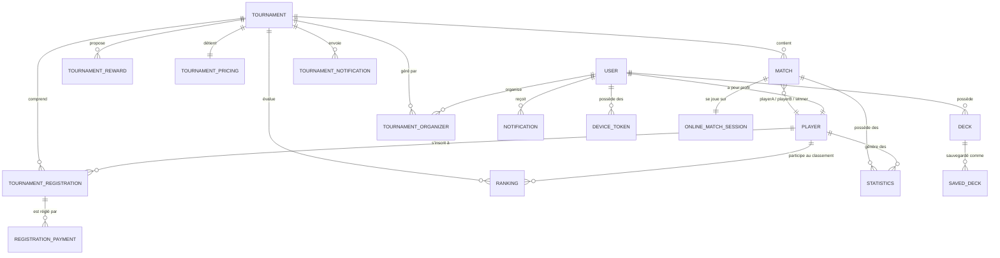
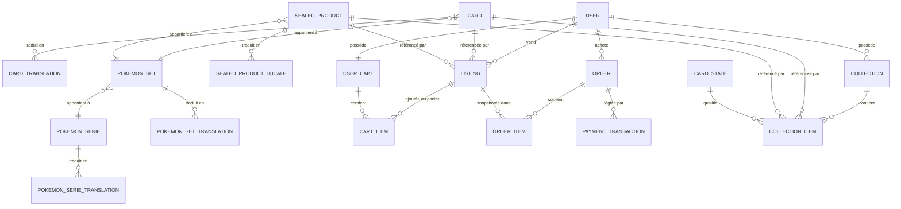

Cette section documente le modèle physique de données (schéma PostgreSQL via TypeORM) de **TCG Nexus**. Elle présente les entités majeures du système, leurs relations ainsi qu'un diagramme conceptuel complet.

## Diagramme entité-association (ERD)

Le diagramme ci-dessous illustre l'organisation globale de la base de données et les dépendances entre les différents modules applicatifs (Utilisateurs, Decks, Tournois, Matchs, Récompenses/Social).

```mermaid
erDiagram
    USER ||--|| PLAYER : "a pour profil"
    USER ||--o{ DECK : "possède"
    USER ||--o{ TOURNAMENT_ORGANIZER : "organise"
    USER ||--o{ NOTIFICATION : "reçoit"
    USER ||--o{ DEVICE_TOKEN : "possède des"

    PLAYER ||--o{ TOURNAMENT_REGISTRATION : "s'inscrit à"
    PLAYER ||--o{ RANKING : "participe au classement"
    PLAYER ||--o{ STATISTICS : "génère des"

    TOURNAMENT ||--o{ TOURNAMENT_REGISTRATION : "comprend"
    TOURNAMENT ||--o{ TOURNAMENT_ORGANIZER : "géré par"
    TOURNAMENT ||--o{ TOURNAMENT_REWARD : "propose"
    TOURNAMENT ||--|| TOURNAMENT_PRICING : "détient"
    TOURNAMENT ||--o{ MATCH : "contient"
    TOURNAMENT ||--o{ RANKING : "évalue"
    TOURNAMENT ||--o{ TOURNAMENT_NOTIFICATION : "envoie"

    TOURNAMENT_REGISTRATION ||--o{ REGISTRATION_PAYMENT : "est réglé par"

    MATCH ||--|| ONLINE_MATCH_SESSION : "se joue sur"
    MATCH ||--o{ STATISTICS : "possède des"
    MATCH }o--|| PLAYER : "playerA / playerB / winner"

    DECK ||--o{ SAVED_DECK : "sauvegardé comme"
```

Ce diagramme couvre uniquement le domaine tournoi/match. Trois autres domaines existent, détaillés plus bas : **catalogue & traductions**, **marketplace & panier**, **decks & collections**.

```mermaid
erDiagram
    CARD ||--o{ CARD_TRANSLATION : "traduit en"
    CARD }o--|| POKEMON_SET : "appartient à"
    POKEMON_SET }o--|| POKEMON_SERIE : "appartient à"
    POKEMON_SET ||--o{ POKEMON_SET_TRANSLATION : "traduit en"
    POKEMON_SERIE ||--o{ POKEMON_SERIE_TRANSLATION : "traduit en"
    SEALED_PRODUCT ||--o{ SEALED_PRODUCT_LOCALE : "traduit en"
    SEALED_PRODUCT }o--|| POKEMON_SET : "appartient à"

    USER ||--o{ LISTING : "vend"
    USER ||--o{ ORDER : "achète"
    USER ||--|| USER_CART : "possède"
    CARD ||--o{ LISTING : "référencée par"
    SEALED_PRODUCT ||--o{ LISTING : "référencé par"
    LISTING ||--o{ CART_ITEM : "ajoutée au panier"
    USER_CART ||--o{ CART_ITEM : "contient"
    ORDER ||--o{ ORDER_ITEM : "contient"
    ORDER ||--o{ PAYMENT_TRANSACTION : "réglée par"
    LISTING ||--o{ ORDER_ITEM : "snapshotée dans"

    USER ||--o{ COLLECTION : "possède"
    COLLECTION ||--o{ COLLECTION_ITEM : "contient"
    CARD ||--o{ COLLECTION_ITEM : "référencée par"
    SEALED_PRODUCT ||--o{ COLLECTION_ITEM : "référencé par"
    CARD_STATE ||--o{ COLLECTION_ITEM : "qualifie"
```

---

## Liste des entités majeures

### 1. Utilisateurs et Joueurs (`User` / `Player`)

- **`User`** : Gère l'authentification et les métadonnées de base (email, mot de passe hashé, prénom, nom, rôle système : `ADMIN`, `MODERATOR`, `USER`).
- **`Player`** : Profil public de joueur. Il contient le score d'expérience (`xp`), le niveau (`level`), le score d'appariement (`elo`), et pointe vers un compte `User` via une relation `@OneToOne`.

### 2. Tournois (`Tournament` et associés)

- **`Tournament`** : Stocke les détails d'un tournoi (nom, description, dates de début/fin, format de jeu, statut : `draft`, `registration_open`, `registration_closed`, `in_progress`, `finished`, `cancelled`).
- **`TournamentRegistration`** : Représente la liaison entre un `Player` et un `Tournament` avec un statut d'inscription (`PENDING`, `CONFIRMED`, `CANCELLED`) et l'indicateur de présence (`checkedIn`).
- **`TournamentPricing`** : Paramètres financiers du tournoi (prix d'inscription).
- **`TournamentReward`** : Liste des lots attribués selon le classement final.
- **`TournamentOrganizer`** : Associe des `User` pour co-gérer l'administration du tournoi avec un rôle spécifique (`owner`, `admin`, `moderator`, `judge`).

### 3. Matchs et Sessions de jeu (`Match` / `OnlineMatchSession`)

- **`Match`** : Représente une rencontre entre deux joueurs dans un round précis d'un tournoi.
  - Liaisons : `playerA` (Joueur A), `playerB` (Joueur B), et `winner` (Vainqueur).
  - Statut : `scheduled`, `in_progress`, `finished`, `cancelled`, `forfeit`.
- **`OnlineMatchSession`** : Session de jeu temps réel attachée à un `Match`. Stocke l'état complet sérialisé du moteur de jeu (`serializedState`), le seed aléatoire, et l'historique des actions (`eventLog`) pour la reconnexion et le replay.

### 4. Statistiques et Classements (`Statistics` / `Ranking`)

- **`Ranking`** : Tableau de bord des performances cumulées d'un joueur au sein d'un tournoi (nombre de victoires, défaites, nuls, total de points, win-rate).
- **`Statistics`** : Métriques détaillées enregistrées pour chaque joueur à la fin d'un match (points marqués, victoire/défaite, rôles).

### 5. Catalogue Pokémon et traductions (`Card`, `PokemonSet`, `PokemonSerie` + traductions)

- **`Card`** (module `pokemon-card`) : données non linguistiques d'une carte (identifiants, HP, types, prix marché TCGPlayer/CardMarket, légalité, rattachement à un `PokemonSet`).
- **`CardTranslation`** (`card_translation`, clé primaire `(cardId, locale)`) : champs dépendant de la langue — nom, texte, capacités/attaques traduites, **et l'image** (TCGdex sert une image par langue). Aucune langue n'est canonique ; ajouter une langue n'affecte pas les autres.
- **`PokemonSet`** / **`PokemonSerie`** : hiérarchie set → série. Chacun a sa table de traduction (`PokemonSetTranslation`, `PokemonSerieTranslation`) pour nom/logo localisés.
- **`SealedProduct`** : produits scellés (displays, ETB…), distincts des cartes, rattachés à un `PokemonSet`. **`SealedProductLocale`** (clé composite `(sealedProductId, locale)`) porte le nom localisé — remplace un ancien champ `nameEn` qui contenait en réalité du texte français.
- **`Translation`** (`translation`, unique sur `(locale, key)`) : surcouche éditable des dictionnaires de traduction de l'interface (hors catalogue) — seules les clés modifiées depuis l'administration y sont stockées, le reste vient des fichiers de dictionnaire versionnés. Exposée via `GET/PUT /translations`, voir [Traductions](../backend/translations).
- `User.preferredLocale` stocke la langue préférée de chaque utilisateur (défaut `fr`).

### 6. Marketplace, panier et paiements (`Listing`, `Order`, `OrderItem`, `PaymentTransaction`, `UserCart`)

Détaillé dans [Marketplace & paiements](../backend/marketplace) (cycle de vie complet, réservation de stock, snapshot). Résumé structurel :

- **`Listing`** : une annonce référence *soit* une `Card` *soit* un `SealedProduct` (discriminant `productKind`), porte `price`/`currency`/`quantityAvailable`, et `shippingCost`/`handlingTimeDays` (frais de port figés à la publication).
- **`UserCart`** / **`CartItem`** : panier persistant par utilisateur, une ligne par `Listing` ajoutée (contrainte unique `(cart, listing)`).
- **`Order`** / **`OrderItem`** : une commande regroupe des lignes multi-vendeurs. `OrderItem` **recopie** (snapshot) le nom, l'image, l'état, la langue et le vendeur de la `Listing` au moment de l'achat — la ligne reste lisible même si l'annonce est supprimée depuis.
- **`PaymentTransaction`** : trace un paiement Stripe rattaché à une `Order` (méthode, statut, montant, devise).

### 7. Decks et collections (`Deck`, `Collection`, `CollectionItem`, `CardState`)

- **`Deck`** : liste de cartes d'un utilisateur, visibilité publique/privée, rattaché à un `DeckFormat`. Les cartes du deck sont dans `DeckCard` (relation many-to-many avec quantité).
- **`Collection`** : ensemble nommé d'items appartenant à un utilisateur (peut représenter une collection réelle ou une wishlist/favoris selon l'usage côté service).
- **`CollectionItem`** : référence *soit* une `Card` *soit* un `SealedProduct` (discriminant `productKind`, même pattern que `Listing`), avec un état (`CardState` pour les cartes, `SealedCondition` pour le scellé).
- **`CardState`** : référentiel des états de carte (Near Mint, Played…), seedé via `npm run seed:cardstates`, réutilisé par le marketplace et les collections.

### 8. Notifications (`Notification`, `DeviceToken`)

- **`Notification`** : notification in-app d'un utilisateur (titre, corps, lu/non lu, `type`). Les notifications récentes sont traduites à la volée via `translationKey` + `data` (paramètres) plutôt que par titre/corps figés — voir [Notifications](../backend/notifications).
- **`DeviceToken`** : jetons de notification push (Expo/FCM) rattachés à un utilisateur, un par appareil enregistré depuis le mobile.
