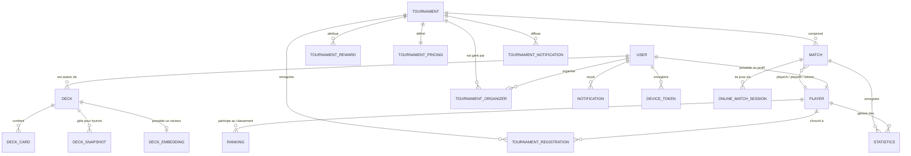
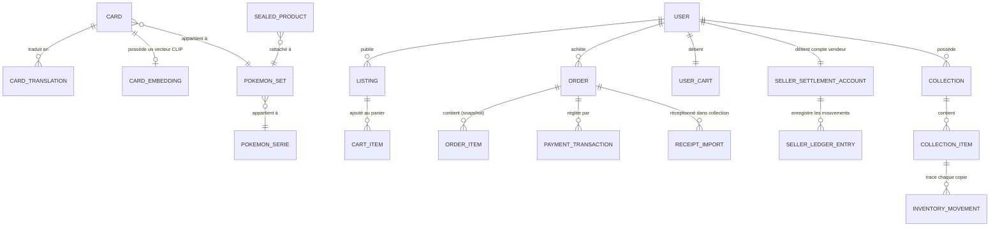
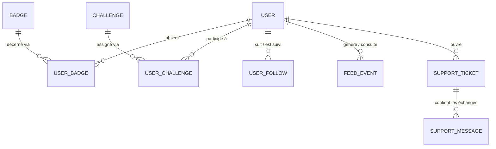

Cette section documente le modèle physique de données (schéma PostgreSQL via TypeORM avec extension `pgvector`) de **TCG Nexus**. Elle présente l'organisation conceptuelle globale, les diagrammes entité-association et la description des entités majeures.

---

## 1. Diagramme entité-association global (ERD)

### Compétition, Joueurs & Matchs

```mermaid
erDiagram
    USER ||--|| PLAYER : "possède un profil"
    USER ||--o{ DECK : "est auteur de"
    USER ||--o{ TOURNAMENT_ORGANIZER : "organise"
    USER ||--o{ NOTIFICATION : "reçoit"
    USER ||--o{ DEVICE_TOKEN : "enregistre"

    PLAYER ||--o{ TOURNAMENT_REGISTRATION : "s'inscrit à"
    PLAYER ||--o{ RANKING : "participe au classement"
    PLAYER ||--o{ STATISTICS : "génère des"

    TOURNAMENT ||--o{ TOURNAMENT_REGISTRATION : "enregistre"
    TOURNAMENT ||--o{ TOURNAMENT_ORGANIZER : "est géré par"
    TOURNAMENT ||--o{ TOURNAMENT_REWARD : "attribue"
    TOURNAMENT ||--|| TOURNAMENT_PRICING : "définit"
    TOURNAMENT ||--o{ MATCH : "comprend"
    TOURNAMENT ||--o{ TOURNAMENT_NOTIFICATION : "diffuse"

    MATCH ||--o{ ONLINE_MATCH_SESSION : "se joue via"
    MATCH }o--|| PLAYER : "playerA / playerB / winner"
    MATCH ||--o{ STATISTICS : "enregistre"

    DECK ||--o{ DECK_CARD : "contient"
    DECK ||--o{ DECK_SNAPSHOT : "gèle pour tournoi"
    DECK ||--o| DECK_EMBEDDING : "possède un vecteur"
```

### Catalogue, Marketplace, Grand Livre & Inventaire

```mermaid
erDiagram
    CARD ||--o{ CARD_TRANSLATION : "traduit en"
    CARD ||--o| CARD_EMBEDDING : "possède un vecteur CLIP"
    CARD }o--|| POKEMON_SET : "appartient à"
    POKEMON_SET }o--|| POKEMON_SERIE : "appartient à"
    SEALED_PRODUCT }o--|| POKEMON_SET : "rattaché à"

    USER ||--o{ LISTING : "publie"
    USER ||--o{ ORDER : "achète"
    USER ||--|| USER_CART : "détient"
    USER ||--|| SELLER_SETTLEMENT_ACCOUNT : "détient compte vendeur"

    LISTING ||--o{ CART_ITEM : "ajouté au panier"
    ORDER ||--o{ ORDER_ITEM : "contient (snapshot)"
    ORDER ||--o{ PAYMENT_TRANSACTION : "réglée par"
    ORDER ||--o{ RECEIPT_IMPORT : "réceptionné dans collection"

    SELLER_SETTLEMENT_ACCOUNT ||--o{ SELLER_LEDGER_ENTRY : "enregistre les mouvements"
    USER ||--o{ COLLECTION : "possède"
    COLLECTION ||--o{ COLLECTION_ITEM : "contient"
    COLLECTION_ITEM ||--o{ INVENTORY_MOVEMENT : "trace chaque copie"
```

### Gamification, Social & Support

```mermaid
erDiagram
    USER ||--o{ USER_BADGE : "obtient"
    USER ||--o{ USER_CHALLENGE : "participe à"
    USER ||--o{ USER_FOLLOW : "suit / est suivi"
    USER ||--o{ FEED_EVENT : "génère / consulte"
    USER ||--o{ SUPPORT_TICKET : "ouvre"
    SUPPORT_TICKET ||--o{ SUPPORT_MESSAGE : "contient les échanges"
    BADGE ||--o{ USER_BADGE : "décerné via"
    CHALLENGE ||--o{ USER_CHALLENGE : "assigné via"
```

---

## 2. Description des domaines de données

### Utilisateurs, Profils & Authentification
- **`User`** : compte utilisateur principal (identifiants, mot de passe hashé avec sel, rôle RBAC `admin` / `moderator` / `user`, préférence linguistique `preferredLocale`, flag `isPro`).
- **`Player`** : profil de joueur public (points d'expérience `xp`, niveau `level`, cote de classement `elo`, statistiques de victoires/défaites).

### Tournois & Matchs
- **`Tournament`** : paramétrage d'un tournoi (nom, format `Standard`/`Expanded`, structure en rondes suisses ou arbre à élimination, statut de cycle de vie, horloge officielle du round actif).
- **`TournamentRegistration`** : inscription d'un joueur, validation du check-in et statut de présence.
- **`DeckSnapshot`** : copie figée de la liste de 60 cartes déposée par le joueur avant le début du tournoi (TRN-02), avec audit de conformité et dérogations d'arbitrage.
- **`Match`** : rencontre planifiée entre deux compétiteurs pour un round précis.
- **`OnlineMatchSession`** : session temps réel attachée à un match (`serializedState` du moteur de règles, seed pseudo-aléatoire et journal complet des actions pour reconnexion et replay).

### Catalogue Pokémon & Internationalisation
- **`Card`** (module `pokemon-card`) : données factuelles de la carte (identifiant unique, numéro dans l'extension, points de vie, rareté, cote de marché).
- **`CardTranslation`** : données localisées (nom, texte des capacités et attaques, URL de l'illustration spécifique à la langue).
- **`PokemonSet`** / **`PokemonSerie`** : arborescence des séries et des sets, avec tables de traduction associées (`PokemonSetTranslation`, `PokemonSerieTranslation`).
- **`SealedProduct`** / **`SealedProductLocale`** : produits scellés (boosters, tripacks, Elite Trainer Boxes, displays) rattachés aux sets.
- **`Translation`** : surcouche de dictionnaire d'interface modifiable en ligne par les administrateurs.

### Marketplace, Grand Livre Vendeur & Inventaire
- **`Listing`** : offre de vente d'une carte ou d'un produit scellé (`productKind`), prix, devise, état d'usure, quantité disponible et frais de port figés.
- **`UserCart`** / **`CartItem`** : panier d'achat persistant par utilisateur (une seule devise acceptée par panier).
- **`Order`** / **`OrderItem`** : commande multi-vendeurs avec réservation pessimiste de stock. `OrderItem` conserve un **snapshot immuable** des informations de l'article au moment de l'achat.
- **`PaymentTransaction`** : traçabilité du paiement Stripe et des compensations financières éventuelles.
- **`SellerLedgerEntry`** : grand livre comptable immuable traçant chaque centime (fonds sous séquestre `pending`, disponibles `available`, bloqués `on_hold` ou versés `paid_out`).
- **`InventoryMovement`** : journal des copies physiques d'un item de collection (copies disponibles, réservées pour vente ou vendues).
- **`ReceiptImport`** : bons d'importation certifiant la réception physique d'une commande dans la collection de l'acheteur.

### Decks, Collections & IA
- **`Deck`** / **`DeckCard`** : composition d'un deck de 60 cartes avec visibilité publique ou privée et association de format.
- **`Collection`** / **`CollectionItem`** : inventaire personnel de l'utilisateur (cartes et scellé) avec états d'usure (`CardState`).
- **`CardEmbedding`** : vecteur de caractéristiques visuelles de 512 dimensions produit par CLIP via le microservice Vision.
- **`DeckEmbedding`** : vecteur d'archétype moyen calculé dans PostgreSQL via l'extension `pgvector` pour la recherche de decks similaires.

### Gamification, Social, Support & Outbox
- **`Badge`** / **`UserBadge`** : hauts faits débloqués par les utilisateurs.
- **`Challenge`** / **`UserChallenge`** : défis et quêtes avec suivi de progression et gains de récompenses.
- **`UserFollow`** : relations d'abonnement entre membres de la communauté.
- **`FeedEvent`** : événements publiés dans le fil d'actualité des utilisateurs abonnés.
- **`SupportTicket`** / **`SupportMessage`** : réclamations et fils d'assistance utilisateur.
- **`OutboxMessage`** / **`ProcessedEvent`** : modèle transactionnel Outbox garantissant la publication fiable et idempotente des événements de domaine.
- **`AuditLog`** : journal de traçabilité des actions administratives sensibles.
