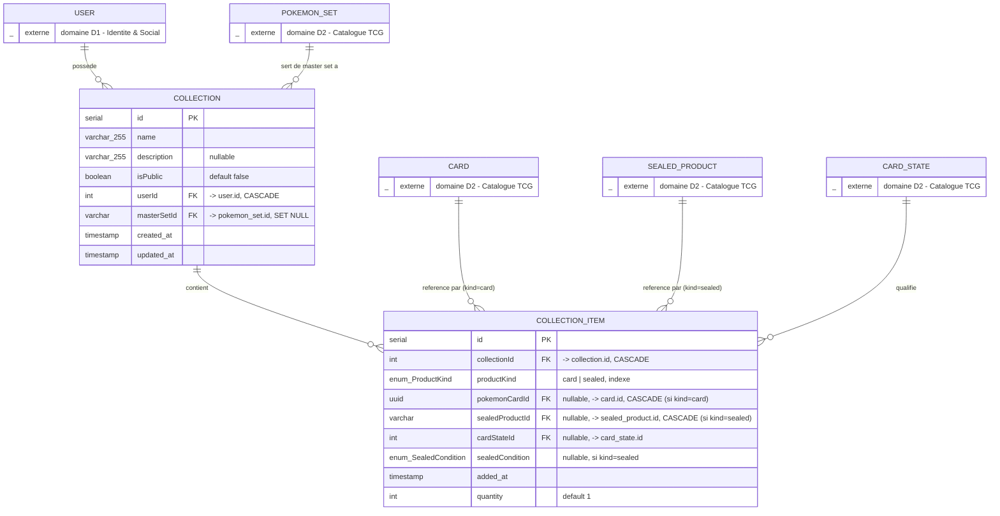
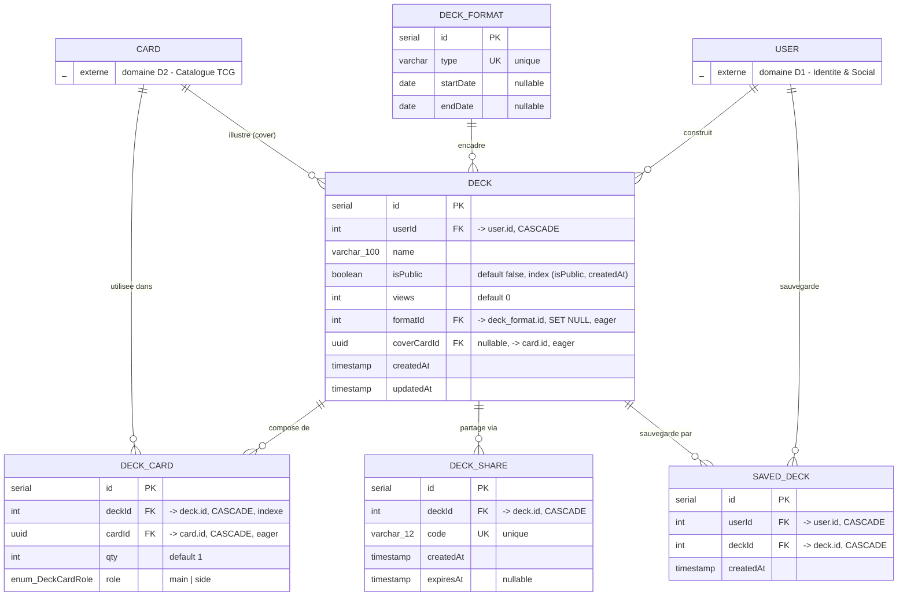
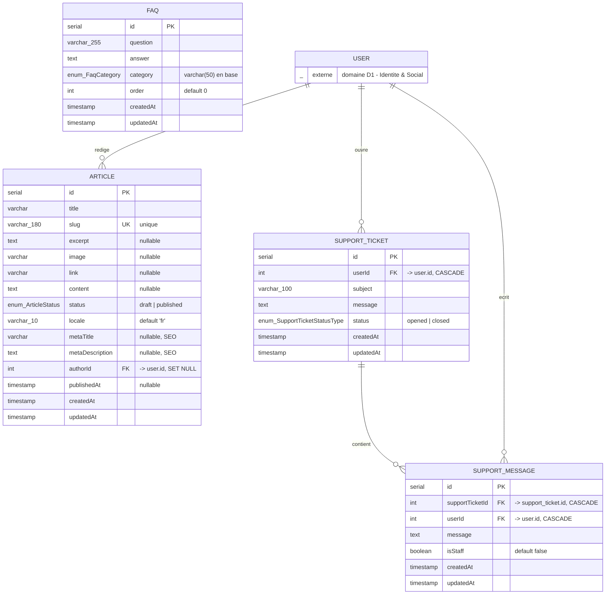

# TCG Nexus — Cartographie du modele de donnees (ER)

> Document de reference genere depuis les entites TypeORM de `apps/api/src/**/*.entity.ts`.
> Objectif : reconstruire le diagramme ER dans Lucidchart sans revenir au code.

**57 tables** · **78 relations** · **41 enumerations** · **8 domaines fonctionnels**

---

## 0. Comment utiliser ce document dans Lucidchart

Trois options, de la plus rapide a la plus manuelle.

### Option A — Import Mermaid (recommandee, ~2 min)

Lucidchart importe nativement le code Mermaid.

1. Dans Lucidchart : **Fichier > Importer un diagramme > Mermaid** (ou le panneau lateral **+ > Importer des donnees > Mermaid**).
2. Coller le bloc de la section **2. Diagramme global** (vue relations seules) ou d'une des sections **4.x** (vue detaillee par domaine).
3. Cliquer sur **Importer**. Les entites arrivent en notation crow's foot, deja reliees.
4. Repasser en mise en forme : appliquer une couleur par domaine (palette en section 1).

> Conseil : n'importe **pas** les 57 tables d'un coup. Fais une page Lucidchart par domaine (sections 4.1 a 4.8), puis une page "vue d'ensemble" avec le diagramme global. C'est ce qui donne un rendu lisible et c'est aussi comme ca que le modele se raisonne.

### Option B — Import ERD depuis SQL

Lucidchart sait faire du reverse-engineering depuis du DDL PostgreSQL : **+ > Importer des donnees > Base de donnees > PostgreSQL**, puis coller le contenu de `ER-TCG-NEXUS.sql` (fichier joint). Avantage : types exacts. Inconvenient : pas de libelles de relation.

### Option C — Saisie manuelle guidee

Utiliser `ER-TCG-NEXUS.xlsx` : l'onglet `02_Champs` donne table / champ / type / cle / note dans l'ordre exact de saisie, et `03_Relations` liste chaque trait a tracer avec sa cardinalite. L'onglet `05_Ordre_construction` donne l'ordre de pose recommande.

---

## 1. Les 8 domaines fonctionnels

| # | Domaine | Couleur suggeree | Tables | Role |
|---|---|---|---|---|
| D1 | **Identite & Social** | `#7C3AED` | 10 | Comptes, profils competitifs, graphe social, gamification (badges/defis), notifications |
| D2 | **Catalogue TCG** | `#0EA5E9` | 11 | Catalogue TCG multi-jeux et multi-langues : series, sets, cartes, produits scelles, i18n |
| D3 | **Collection** | `#10B981` | 2 | Classeurs utilisateurs et lignes de collection polymorphes (carte ou scelle) |
| D4 | **Deck Building** | `#F59E0B` | 5 | Construction de decks, formats de jeu, partage et sauvegarde |
| D5 | **Marketplace** | `#EF4444` | 10 | Annonces, panier, commandes, paiements, historique de prix et analytics produit |
| D6 | **Tournoi** | `#EC4899` | 8 | Cycle de vie d'un tournoi : staff, inscriptions, tarification, paiements, recompenses |
| D7 | **Match & Classement** | `#6366F1` | 7 | Bracket, statistiques, classements Elo et sessions du moteur de jeu live |
| D8 | **Contenu & Support** | `#64748B` | 4 | Blog, FAQ et support client |

### Conventions de nommage relevees dans le code

- **Tables** : `snake_case` du nom de classe (strategie de nommage TypeORM par defaut), sauf nom explicite dans `@Entity("...")` — ex. `card_events`, `sealed_events`, `faq`.
- **Colonnes** : le nom de propriete est conserve tel quel, donc **camelCase** (`quantityAvailable`, `createdAt`), sauf `@Column({ name })` explicite en `snake_case`.
- **Cles etrangeres** : `@JoinColumn({ name })` quand precise (`seller_id`, `card_id`), sinon `<propriete>Id` (`tournamentId`, `playerAId`).
- **Cles primaires** : `serial` auto-incremente par defaut ; `uuid` pour `card` ; **PK textuelle externe** pour `pokemon_serie`, `pokemon_set`, `sealed_product` (identifiants provenant de la source TCGdex) ; **PK composite** pour toutes les tables de traduction.
- **Horodatage** : `createdAt` / `updatedAt` via `@CreateDateColumn` / `@UpdateDateColumn` sur la quasi-totalite des tables. Seul `listing` a un soft-delete (`deletedAt`).

---

## 2. Diagramme global — vue relations

Vue d'ensemble sans les attributs : c'est la carte a poser en premier dans Lucidchart. `user` et `card` sont les deux hubs du modele.

```mermaid
erDiagram
    %% ---- D1 Identite & Social ----
    USER ||--o| PLAYER : "possede un profil joueur"
    USER ||--o{ USER_FOLLOW : "suit (following)"
    USER ||--o{ USER_FOLLOW : "est suivi par (followers)"
    USER ||--o{ USER_BADGE : "a debloque"
    BADGE ||--o{ USER_BADGE : "est attribue via"
    CHALLENGE ||--o{ ACTIVE_CHALLENGE : "est instancie en"
    ACTIVE_CHALLENGE ||--o{ USER_CHALLENGE : "suivi par"
    USER ||--o{ USER_CHALLENGE : "progresse sur"
    USER ||--o{ NOTIFICATION : "recoit"
    USER ||--o{ DEVICE_TOKEN : "enregistre"
    USER ||--o{ COLLECTION : "possede"
    USER ||--o{ DECK : "construit"
    USER ||--o{ SAVED_DECK : "sauvegarde"
    USER ||--o{ LISTING : "vend (seller)"
    USER ||--o| USER_CART : "possede un panier"
    USER ||--o{ ORDER : "commande (buyer)"
    USER ||--o{ ORDER_ITEM : "expedie (seller)"
    USER ||--o{ CARD_EVENTS : "declenche"
    USER ||--o{ SEALED_EVENTS : "declenche"
    PLAYER ||--o{ TOURNAMENT_PLAYERS : "jonction N-N"
    USER ||--o{ TOURNAMENT_ORGANIZER : "organise"
    PLAYER ||--o{ TOURNAMENT_REGISTRATION : "s'inscrit via"
    PLAYER ||--o{ MATCH : "joue en A"
    PLAYER ||--o{ MATCH : "joue en B"
    PLAYER ||--o{ MATCH : "gagne"
    PLAYER ||--o{ STATISTICS : "mesure par"
    PLAYER ||--o{ RANKING : "classe via"
    USER ||--o{ CASUAL_MATCH_SESSION : "joue en A"
    USER ||--o{ CASUAL_MATCH_SESSION : "joue en B"
    USER ||--o{ TRAINING_MATCH_SESSION : "s'entraine via"
    USER ||--o{ RANKED_MATCH_HISTORY : "gagne"
    USER ||--o{ RANKED_MATCH_HISTORY : "perd"
    USER ||--o{ ARTICLE : "redige"
    USER ||--o{ SUPPORT_TICKET : "ouvre"
    USER ||--o{ SUPPORT_MESSAGE : "ecrit"
    %% ---- D2 Catalogue TCG ----
    POKEMON_SERIE ||--o{ POKEMON_SERIE_TRANSLATION : "traduite en"
    POKEMON_SERIE ||--o{ POKEMON_SET : "contient"
    POKEMON_SET ||--o{ POKEMON_SET_TRANSLATION : "traduit en"
    POKEMON_SET ||--o{ CARD : "contient"
    POKEMON_SET ||--o{ SEALED_PRODUCT : "decline en"
    CARD ||--o{ CARD_TRANSLATION : "traduite en"
    CARD ||--o| POKEMON_CARD_DETAILS : "detaille par"
    SEALED_PRODUCT ||--o{ SEALED_PRODUCT_LOCALE : "traduit en"
    POKEMON_SET ||--o{ COLLECTION : "sert de master set a"
    CARD ||--o{ COLLECTION_ITEM : "reference par (kind=card)"
    SEALED_PRODUCT ||--o{ COLLECTION_ITEM : "reference par (kind=sealed)"
    CARD_STATE ||--o{ COLLECTION_ITEM : "qualifie"
    CARD ||--o{ DECK : "illustre (cover)"
    CARD ||--o{ DECK_CARD : "utilisee dans"
    CARD ||--o{ LISTING : "mise en vente (kind=card)"
    SEALED_PRODUCT ||--o{ LISTING : "mis en vente (kind=sealed)"
    CARD ||--o{ PRICE_HISTORY : "historisee par"
    SEALED_PRODUCT ||--o{ PRICE_HISTORY : "historise par"
    CARD ||--o{ CARD_EVENTS : "genere"
    SEALED_PRODUCT ||--o{ SEALED_EVENTS : "genere"
    CARD ||--o{ CARD_POPULARITY_METRICS : "agregee en"
    %% ---- D3 Collection ----
    COLLECTION ||--o{ COLLECTION_ITEM : "contient"
    %% ---- D4 Deck Building ----
    DECK_FORMAT ||--o{ DECK : "encadre"
    DECK ||--o{ DECK_CARD : "compose de"
    DECK ||--o{ DECK_SHARE : "partage via"
    DECK ||--o{ SAVED_DECK : "sauvegarde par"
    %% ---- D5 Marketplace ----
    USER_CART ||--o{ CART_ITEM : "contient"
    LISTING ||--o{ CART_ITEM : "ajoutee au panier via"
    ORDER ||--o{ ORDER_ITEM : "detaillee par"
    LISTING ||--o{ ORDER_ITEM : "vendue via"
    ORDER ||--o{ PAYMENT_TRANSACTION : "payee par"
    %% ---- D6 Tournoi ----
    TOURNAMENT ||--o| TOURNAMENT_PRICING : "tarife par"
    TOURNAMENT ||--o{ TOURNAMENT_PLAYERS : "jonction N-N"
    TOURNAMENT ||--o{ TOURNAMENT_ORGANIZER : "organise par"
    TOURNAMENT ||--o{ TOURNAMENT_REGISTRATION : "recoit"
    TOURNAMENT_REGISTRATION ||--o{ REGISTRATION_PAYMENT : "payee par"
    TOURNAMENT ||--o{ TOURNAMENT_REWARD : "recompense par"
    TOURNAMENT ||--o{ TOURNAMENT_NOTIFICATION : "annonce via"
    TOURNAMENT ||--o{ MATCH : "comporte"
    TOURNAMENT ||--o{ RANKING : "classe via"
    %% ---- D7 Match & Classement ----
    MATCH ||--o{ STATISTICS : "mesure par"
    MATCH ||--o| ONLINE_MATCH_SESSION : "joue en ligne via"
    %% ---- D8 Contenu & Support ----
    SUPPORT_TICKET ||--o{ SUPPORT_MESSAGE : "contient"
```



### Lecture rapide des hubs

| Table | Relations | Pourquoi |
|---|---|---|
| `user` | 25 | Racine de toutes les donnees personnelles : collections, decks, ventes, commandes, tournois, support |
| `card` | 10 | Reference partagee par le deck building, la collection, le marketplace et l'analytics |
| `player` | 8 | Identite competitive utilisee par tout le domaine tournoi |
| `tournament` | 8 | Agrege staff, inscriptions, tarifs, recompenses, matchs et classements |
| `sealed_product` | 6 | Pendant scelle de Card sur les memes axes (collection, vente, prix, events) |
| `deck` | 6 |  |

---

## 3. Les 7 points de modelisation a comprendre avant de dessiner

Ce sont les endroits ou un diagramme ER naif se trompe. A lire avant de tracer quoi que ce soit.

### 3.1 Les associations polymorphes carte / scelle

`collection_item`, `listing` et `price_history` portent chacune **deux FK nullables mutuellement exclusives** — une vers `card`, une vers `sealed_product` — arbitrees par le discriminant `productKind` (`card` | `sealed`).

Sur le diagramme : tracer les deux traits en **pointilles / cardinalite optionnelle (0..1)** et annoter le discriminant. Ne pas modeliser comme deux relations obligatoires.

```
card ──0..1──┐
             ├── collection_item  (productKind decide laquelle est renseignee)
sealed_product ──0..1──┘
```

### 3.2 L'i18n est sortie des tables principales

`card`, `pokemon_set`, `pokemon_serie` et `sealed_product` ne portent **aucun texte localise**. Nom, image, rarete, effets vivent dans des tables satellites a **PK composite `(<entite>_id, locale)`** : `card_translation`, `pokemon_set_translation`, `pokemon_serie_translation`, `sealed_product_locale`.

Les proprietes `name`, `image`, `rarity` visibles sur `Card` en TypeScript sont des champs **hydrates en memoire** (non `@Column`) — elles n'existent pas en base et ne doivent pas figurer dans le diagramme.

`translation` (cle/valeur/locale) est une table i18n **generique** de l'interface, sans lien avec le catalogue.

### 3.3 `User` et `Player` sont deux identites distinctes

`user` = compte (auth, marketplace, collection, deck). `player` = identite competitive (XP, niveau, Elo) en **1-1 optionnel**, portee par `player.userId`.

Consequence : le domaine tournoi (`match`, `ranking`, `tournament_registration`, `tournament_players`) pointe vers **`player`**, alors que le jeu libre (`casual_match_session`, `training_match_session`, `ranked_match_history`) pointe vers **`user`**. C'est une asymetrie assumee du modele, pas une erreur : la representer telle quelle.

### 3.4 Les snapshots denormalises de `order_item`

`order_item` recopie le produit au moment de l'achat (`productName`, `productImage`, `productCondition`, `productLanguage`, `productSetName`, `sellerName`) et sa FK `listing_id` est `SET NULL`. L'annonce peut donc disparaitre sans casser l'historique de commande.

Sur le diagramme : cardinalite **0..1** cote `listing`, et signaler le bloc snapshot par une note.

### 3.5 Les references logiques sans contrainte FK

Plusieurs colonnes sont des identifiants **sans FK declaree** — le moteur de jeu et l'historique Elo les resolvent applicativement :

| Table | Colonnes | Cible logique |
|---|---|---|
| `online_match_session` | `playerADeckId`, `playerBDeckId`, `winnerPlayerId` | `deck.id`, `player.id` |
| `casual_match_session` | `playerADeckId`, `playerBDeckId`, `winnerUserId` | `deck.id`, `user.id` |
| `training_match_session` | `playerDeckId` | `deck.id` |
| `ranked_match_history` | `matchId`, `casualSessionId` | `match.id`, `casual_match_session.id` |

A tracer en **traits pointilles non contraints** si tu veux les montrer, ou a laisser en simple annotation. Ne pas les dessiner comme des FK dures : ce serait faux.

### 3.6 Le 1-1 `tournament` / `tournament_pricing` est porte cote tournoi

`@JoinColumn()` est place sur `Tournament`, donc la colonne FK est **`tournament.pricingId`**. La table `tournament_pricing` **n'a aucune colonne `tournamentId`** : dessiner un seul trait, porte cote tournoi.

Corollaire : le `onDelete: "CASCADE"` declare sur `TournamentPricing.tournament` est du cote sans `@JoinColumn`, donc **ignore par TypeORM**. La FK reelle est en `NO ACTION`.

Meme logique pour `player.userId` (FK cote `player`) et `online_match_session.match_id` (FK cote session).

### 3.7 Enums stockes en valeur, pas en table

Attention au faux ami : `card_state` est une **table referentiel** (avec FK depuis `collection_item`), mais `listing.cardState` et `price_history.cardState` sont des **colonnes enum**, sans FK vers cette table. Deux mecanismes pour la meme notion.

Deuxieme faux ami : `listing.language` est type `Languages` cote TypeScript mais son `@Column` **n'a pas `type: "enum"`** — la colonne est donc un simple `varchar` avec `'fr'` par defaut, contrairement a `listing.status`, `listing.cardState` ou `listing.productKind` de la meme table.

Tous les autres enums (section 6) sont des `enum` PostgreSQL natifs : pas de table, pas de trait sur le diagramme.

### 3.8 Ce que le decompte de 57 tables recouvre

Le depot contient 57 fichiers `*.entity.ts`, mais l'un d'eux — `src/ai/entities/ai.entity.ts` — ne contient qu'une classe vide sans decorateur `@Entity` : **il ne produit aucune table** et est exclu de ce document.

En contrepartie, `tournament_players` est une table bien reelle **sans fichier dedie** : elle est generee par le `@JoinTable` de `Tournament.players`. Elle figure donc dans le diagramme.

Bilan : 56 classes `@Entity` + 1 table de jonction = **57 tables**.

---

## 4. Detail par domaine

### 4.1 D1 — Identite & Social

> Comptes, profils competitifs, graphe social, gamification (badges/defis), notifications

| Table | Description |
|---|---|
| `user` | Compte utilisateur, racine de tout le graphe applicatif |
| `player` | Profil competitif 1-1 avec User (XP, niveau, Elo) |
| `user_follow` | Graphe social : abonnements entre utilisateurs |
| `badge` | Catalogue des badges deblocables |
| `user_badge` | Association N-N User <-> Badge avec date de deblocage |
| `challenge` | Modele de defi quotidien / hebdomadaire |
| `active_challenge` | Instanciation datee d'un Challenge (fenetre en cours) |
| `user_challenge` | Progression d'un User sur un ActiveChallenge |
| `notification` | Notification in-app destinee a un User |
| `device_token` | Token push mobile (Expo) rattache a un User |

#### `user`

| Champ | Type | Cle | Null | Note |
|---|---|---|---|---|
| `id` | serial | PK |  |  |
| `email` | varchar | UK |  | unique |
| `firstName` | varchar |  |  |  |
| `lastName` | varchar |  |  |  |
| `password` | varchar |  |  | hash, @Exclude |
| `avatarUrl` | varchar |  | oui |  |
| `role` | enum UserRole |  |  | default 'user' |
| `preferredCurrency` | enum Currency |  |  | default 'EUR' |
| `preferredLocale` | varchar(10) |  |  | default locale |
| `isPro` | boolean |  |  | default false |
| `isActive` | boolean |  |  | default true |
| `emailVerified` | boolean |  |  | default false |
| `refreshToken` | varchar |  | oui | @Exclude |
| `previousRefreshToken` | varchar |  | oui | @Exclude |
| `previousRefreshTokenExpiresAt` | timestamp |  | oui | @Exclude |
| `createdAt` | timestamp |  |  | @CreateDateColumn |
| `updatedAt` | timestamp |  |  | @UpdateDateColumn |

#### `player`

| Champ | Type | Cle | Null | Note |
|---|---|---|---|---|
| `id` | serial | PK |  |  |
| `xp` | int |  |  | default 0 |
| `level` | int |  |  | default 1 |
| `elo` | int |  |  | default 1000 |
| `userId` | int | FK |  | -> user.id, @JoinColumn cote Player |

#### `user_follow`

| Champ | Type | Cle | Null | Note |
|---|---|---|---|---|
| `id` | serial | PK |  |  |
| `follower_id` | int | FK |  | -> user.id, CASCADE |
| `followed_id` | int | FK |  | -> user.id, CASCADE |
| `createdAt` | timestamp |  |  |  |

#### `badge`

| Champ | Type | Cle | Null | Note |
|---|---|---|---|---|
| `id` | serial | PK |  |  |
| `code` | varchar | UK |  | unique |
| `name` | varchar |  |  |  |
| `description` | varchar |  |  |  |
| `icon` | varchar |  |  |  |
| `category` | enum BadgeCategory |  |  |  |
| `threshold` | int |  |  | palier de declenchement |
| `createdAt` | timestamp |  |  |  |

#### `user_badge`

| Champ | Type | Cle | Null | Note |
|---|---|---|---|---|
| `id` | serial | PK |  |  |
| `user_id` | int | FK |  | -> user.id, CASCADE |
| `badge_id` | int | FK |  | -> badge.id, CASCADE, eager |
| `unlockedAt` | timestamp |  |  |  |

#### `challenge`

| Champ | Type | Cle | Null | Note |
|---|---|---|---|---|
| `id` | serial | PK |  |  |
| `title` | varchar |  |  |  |
| `description` | text |  |  |  |
| `type` | enum ChallengeType |  |  | default DAILY |
| `actionType` | enum ChallengeActionType |  |  |  |
| `targetValue` | int |  |  | default 1 |
| `rewardXp` | int |  |  | default 50 |
| `createdAt` | timestamp |  |  |  |
| `updatedAt` | timestamp |  |  |  |

#### `active_challenge`

| Champ | Type | Cle | Null | Note |
|---|---|---|---|---|
| `id` | serial | PK |  |  |
| `challengeId` | int | FK |  | -> challenge.id, CASCADE, eager |
| `expiresAt` | timestamp |  |  |  |
| `createdAt` | timestamp |  |  |  |
| `updatedAt` | timestamp |  |  |  |

#### `user_challenge`

| Champ | Type | Cle | Null | Note |
|---|---|---|---|---|
| `id` | serial | PK |  |  |
| `userId` | int | FK |  | -> user.id, CASCADE |
| `activeChallengeId` | int | FK |  | -> active_challenge.id, CASCADE |
| `progress` | int |  |  | default 0 |
| `isCompleted` | boolean |  |  | default false |
| `isClaimed` | boolean |  |  | default false |
| `createdAt` | timestamp |  |  |  |
| `updatedAt` | timestamp |  |  |  |

#### `notification`

| Champ | Type | Cle | Null | Note |
|---|---|---|---|---|
| `id` | serial | PK |  |  |
| `userId` | int | FK |  | -> user.id, CASCADE |
| `title` | varchar |  |  |  |
| `body` | text |  |  |  |
| `isRead` | boolean |  |  | default false |
| `type` | varchar |  |  | default 'info' |
| `data` | jsonb |  | oui | payload libre |
| `translationKey` | varchar |  | oui | i18n |
| `translationParams` | jsonb |  | oui | i18n |
| `createdAt` | timestamp |  |  |  |
| `updatedAt` | timestamp |  |  |  |

#### `device_token`

| Champ | Type | Cle | Null | Note |
|---|---|---|---|---|
| `id` | serial | PK |  |  |
| `userId` | int | FK |  | -> user.id, CASCADE |
| `token` | varchar | UK |  | unique |
| `platform` | varchar |  |  | default 'expo' |
| `createdAt` | timestamp |  |  |  |

**Diagramme Mermaid — Identite & Social**

```mermaid
erDiagram
    USER {
        serial id PK
        varchar email UK "unique"
        varchar firstName
        varchar lastName
        varchar password "hash, @Exclude"
        varchar avatarUrl "nullable"
        enum_UserRole role "default 'user'"
        enum_Currency preferredCurrency "default 'EUR'"
        varchar_10 preferredLocale "default locale"
        boolean isPro "default false"
        boolean isActive "default true"
        boolean emailVerified "default false"
        varchar refreshToken "nullable, @Exclude"
        varchar previousRefreshToken "nullable, @Exclude"
        timestamp previousRefreshTokenExpiresAt "nullable, @Exclude"
        timestamp createdAt "@CreateDateColumn"
        timestamp updatedAt "@UpdateDateColumn"
    }
    PLAYER {
        serial id PK
        int xp "default 0"
        int level "default 1"
        int elo "default 1000"
        int userId FK "-> user.id, @JoinColumn cote Player"
    }
    USER_FOLLOW {
        serial id PK
        int follower_id FK "-> user.id, CASCADE"
        int followed_id FK "-> user.id, CASCADE"
        timestamp createdAt
    }
    BADGE {
        serial id PK
        varchar code UK "unique"
        varchar name
        varchar description
        varchar icon
        enum_BadgeCategory category
        int threshold "palier de declenchement"
        timestamp createdAt
    }
    USER_BADGE {
        serial id PK
        int user_id FK "-> user.id, CASCADE"
        int badge_id FK "-> badge.id, CASCADE, eager"
        timestamp unlockedAt
    }
    CHALLENGE {
        serial id PK
        varchar title
        text description
        enum_ChallengeType type "default DAILY"
        enum_ChallengeActionType actionType
        int targetValue "default 1"
        int rewardXp "default 50"
        timestamp createdAt
        timestamp updatedAt
    }
    ACTIVE_CHALLENGE {
        serial id PK
        int challengeId FK "-> challenge.id, CASCADE, eager"
        timestamp expiresAt
        timestamp createdAt
        timestamp updatedAt
    }
    USER_CHALLENGE {
        serial id PK
        int userId FK "-> user.id, CASCADE"
        int activeChallengeId FK "-> active_challenge.id, CASCADE"
        int progress "default 0"
        boolean isCompleted "default false"
        boolean isClaimed "default false"
        timestamp createdAt
        timestamp updatedAt
    }
    NOTIFICATION {
        serial id PK
        int userId FK "-> user.id, CASCADE"
        varchar title
        text body
        boolean isRead "default false"
        varchar type "default 'info'"
        jsonb data "nullable, payload libre"
        varchar translationKey "nullable, i18n"
        jsonb translationParams "nullable, i18n"
        timestamp createdAt
        timestamp updatedAt
    }
    DEVICE_TOKEN {
        serial id PK
        int userId FK "-> user.id, CASCADE"
        varchar token UK "unique"
        varchar platform "default 'expo'"
        timestamp createdAt
    }
    %% -- entites externes au domaine (rappel) --
    ARTICLE {
        _ externe "domaine D8 - Contenu & Support"
    }
    CARD_EVENTS {
        _ externe "domaine D5 - Marketplace"
    }
    CASUAL_MATCH_SESSION {
        _ externe "domaine D7 - Match & Classement"
    }
    COLLECTION {
        _ externe "domaine D3 - Collection"
    }
    DECK {
        _ externe "domaine D4 - Deck Building"
    }
    LISTING {
        _ externe "domaine D5 - Marketplace"
    }
    MATCH {
        _ externe "domaine D7 - Match & Classement"
    }
    ORDER {
        _ externe "domaine D5 - Marketplace"
    }
    ORDER_ITEM {
        _ externe "domaine D5 - Marketplace"
    }
    RANKED_MATCH_HISTORY {
        _ externe "domaine D7 - Match & Classement"
    }
    RANKING {
        _ externe "domaine D7 - Match & Classement"
    }
    SAVED_DECK {
        _ externe "domaine D4 - Deck Building"
    }
    SEALED_EVENTS {
        _ externe "domaine D5 - Marketplace"
    }
    STATISTICS {
        _ externe "domaine D7 - Match & Classement"
    }
    SUPPORT_MESSAGE {
        _ externe "domaine D8 - Contenu & Support"
    }
    SUPPORT_TICKET {
        _ externe "domaine D8 - Contenu & Support"
    }
    TOURNAMENT_ORGANIZER {
        _ externe "domaine D6 - Tournoi"
    }
    TOURNAMENT_PLAYERS {
        _ externe "domaine D6 - Tournoi"
    }
    TOURNAMENT_REGISTRATION {
        _ externe "domaine D6 - Tournoi"
    }
    TRAINING_MATCH_SESSION {
        _ externe "domaine D7 - Match & Classement"
    }
    USER_CART {
        _ externe "domaine D5 - Marketplace"
    }
    USER ||--o| PLAYER : "possede un profil joueur"
    USER ||--o{ USER_FOLLOW : "suit (following)"
    USER ||--o{ USER_FOLLOW : "est suivi par (followers)"
    USER ||--o{ USER_BADGE : "a debloque"
    BADGE ||--o{ USER_BADGE : "est attribue via"
    CHALLENGE ||--o{ ACTIVE_CHALLENGE : "est instancie en"
    ACTIVE_CHALLENGE ||--o{ USER_CHALLENGE : "suivi par"
    USER ||--o{ USER_CHALLENGE : "progresse sur"
    USER ||--o{ NOTIFICATION : "recoit"
    USER ||--o{ DEVICE_TOKEN : "enregistre"
    USER ||--o{ COLLECTION : "possede"
    USER ||--o{ DECK : "construit"
    USER ||--o{ SAVED_DECK : "sauvegarde"
    USER ||--o{ LISTING : "vend (seller)"
    USER ||--o| USER_CART : "possede un panier"
    USER ||--o{ ORDER : "commande (buyer)"
    USER ||--o{ ORDER_ITEM : "expedie (seller)"
    USER ||--o{ CARD_EVENTS : "declenche"
    USER ||--o{ SEALED_EVENTS : "declenche"
    PLAYER ||--o{ TOURNAMENT_PLAYERS : "jonction N-N"
    USER ||--o{ TOURNAMENT_ORGANIZER : "organise"
    PLAYER ||--o{ TOURNAMENT_REGISTRATION : "s'inscrit via"
    PLAYER ||--o{ MATCH : "joue en A"
    PLAYER ||--o{ MATCH : "joue en B"
    PLAYER ||--o{ MATCH : "gagne"
    PLAYER ||--o{ STATISTICS : "mesure par"
    PLAYER ||--o{ RANKING : "classe via"
    USER ||--o{ CASUAL_MATCH_SESSION : "joue en A"
    USER ||--o{ CASUAL_MATCH_SESSION : "joue en B"
    USER ||--o{ TRAINING_MATCH_SESSION : "s'entraine via"
    USER ||--o{ RANKED_MATCH_HISTORY : "gagne"
    USER ||--o{ RANKED_MATCH_HISTORY : "perd"
    USER ||--o{ ARTICLE : "redige"
    USER ||--o{ SUPPORT_TICKET : "ouvre"
    USER ||--o{ SUPPORT_MESSAGE : "ecrit"
```



---

### 4.2 D2 — Catalogue TCG

> Catalogue TCG multi-jeux et multi-langues : series, sets, cartes, produits scelles, i18n

| Table | Description |
|---|---|
| `pokemon_serie` | Serie de sets (ex: Scarlet & Violet). PK textuelle externe |
| `pokemon_serie_translation` | Traduction i18n d'une serie |
| `pokemon_set` | Extension / set de cartes. PK textuelle externe |
| `pokemon_set_translation` | Traduction i18n d'un set |
| `card` | Carte unitaire, langue-agnostique. Coeur du catalogue |
| `card_translation` | Contenu localise d'une carte (nom, effets, attaques) |
| `pokemon_card_details` | Donnees de jeu Pokemon (1-1 avec Card), PK = FK |
| `sealed_product` | Produit scelle (booster, display, ETB...). PK textuelle |
| `sealed_product_locale` | Nom localise d'un produit scelle |
| `card_state` | Referentiel des etats physiques de carte (NM, EX, GD...) |
| `translation` | Table i18n generique cle/valeur par locale |

#### `pokemon_serie`

| Champ | Type | Cle | Null | Note |
|---|---|---|---|---|
| `id` | varchar | PK |  | ID externe TCGdex |
| `game` | enum CardGame |  |  | default POKEMON |

#### `pokemon_serie_translation`

| Champ | Type | Cle | Null | Note |
|---|---|---|---|---|
| `serie_id` | varchar | PK,FK |  | -> pokemon_serie.id, CASCADE |
| `locale` | varchar(10) | PK |  | PK composite |
| `name` | varchar |  | oui |  |
| `logo` | varchar |  | oui |  |

#### `pokemon_set`

| Champ | Type | Cle | Null | Note |
|---|---|---|---|---|
| `id` | varchar | PK |  | ID externe TCGdex |
| `game` | enum CardGame |  |  | default POKEMON |
| `cardCountTotal` | int |  |  | embedded CardCount |
| `cardCountOfficial` | int |  |  | embedded CardCount |
| `cardCountReverse` | int |  |  | embedded CardCount |
| `cardCountHolo` | int |  |  | embedded CardCount |
| `cardCountFirstEd` | int |  |  | embedded CardCount |
| `tcgOnline` | varchar |  | oui |  |
| `releaseDate` | varchar |  |  |  |
| `legalStandard` | boolean |  |  | embedded Legal |
| `legalExpanded` | boolean |  |  | embedded Legal |
| `serieId` | varchar | FK | oui | -> pokemon_serie.id |

#### `pokemon_set_translation`

| Champ | Type | Cle | Null | Note |
|---|---|---|---|---|
| `set_id` | varchar | PK,FK |  | -> pokemon_set.id, CASCADE |
| `locale` | varchar(10) | PK |  | PK composite |
| `name` | varchar |  | oui |  |
| `logo` | varchar |  | oui |  |
| `symbol` | varchar |  | oui |  |

#### `card`

| Champ | Type | Cle | Null | Note |
|---|---|---|---|---|
| `id` | uuid | PK |  | @PrimaryGeneratedColumn('uuid') |
| `game` | enum CardGame |  |  | default POKEMON |
| `tcgDexId` | varchar |  | oui | unique (game, tcgDexId) partiel |
| `localId` | varchar |  | oui | numero dans le set |
| `illustrator` | varchar |  | oui |  |
| `variants` | jsonb |  | oui | normal/reverse/holo/firstEdition |
| `variantsDetailed` | jsonb |  | oui | tableau CardVariantDetail |
| `setId` | varchar | FK | oui | -> pokemon_set.id |
| `legal` | jsonb |  | oui | {standard, expanded} |
| `updated` | varchar |  | oui |  |
| `pricing` | jsonb |  | oui | TCGplayer + Cardmarket |

#### `card_translation`

| Champ | Type | Cle | Null | Note |
|---|---|---|---|---|
| `card_id` | uuid | PK,FK |  | -> card.id, CASCADE |
| `locale` | varchar(10) | PK |  | PK composite |
| `name` | varchar |  | oui | index (locale, name) |
| `image` | varchar |  | oui |  |
| `category` | varchar |  | oui |  |
| `rarity` | varchar |  | oui |  |
| `description` | text |  | oui |  |
| `effect` | text |  | oui |  |
| `evolve_from` | varchar |  | oui |  |
| `stage` | varchar |  | oui |  |
| `suffix` | varchar |  | oui |  |
| `item` | jsonb |  | oui | {name, effect} |
| `abilities` | jsonb |  | oui | PokemonAbility[] |
| `attacks` | jsonb |  | oui | PokemonAttack[] |
| `source_updated_at` | varchar |  | oui |  |

#### `pokemon_card_details`

| Champ | Type | Cle | Null | Note |
|---|---|---|---|---|
| `card_id` | uuid | PK,FK |  | -> card.id, CASCADE |
| `category` | enum PokemonCardsType |  | oui | Pokemon/Energy/Trainer |
| `dexId` | int[] |  | oui |  |
| `hp` | int |  | oui |  |
| `types` | text[] |  | oui |  |
| `level` | varchar |  | oui |  |
| `weaknesses` | jsonb |  | oui |  |
| `resistances` | jsonb |  | oui |  |
| `retreat` | int |  | oui |  |
| `regulationMark` | varchar |  | oui |  |
| `trainerType` | enum TrainerType |  | oui |  |
| `energyType` | enum EnergyType |  | oui |  |
| `boosters` | jsonb |  | oui |  |
| `parsedEffects` | jsonb |  | oui | sortie @repo/effect-parser |

#### `sealed_product`

| Champ | Type | Cle | Null | Note |
|---|---|---|---|---|
| `id` | varchar | PK |  |  |
| `productType` | enum SealedProductType |  |  | indexe |
| `pokemon_set_id` | varchar | FK | oui | -> pokemon_set.id, SET NULL |
| `contents` | jsonb |  | oui | boosterCount, promos... |
| `sku` | varchar |  | oui | indexe |
| `upc` | varchar |  | oui | indexe |
| `image` | varchar |  | oui |  |
| `createdAt` | timestamp |  |  |  |
| `updatedAt` | timestamp |  |  |  |

#### `sealed_product_locale`

| Champ | Type | Cle | Null | Note |
|---|---|---|---|---|
| `sealed_product_id` | varchar | PK,FK |  | -> sealed_product.id, CASCADE |
| `locale` | varchar(10) | PK |  | PK composite |
| `name` | varchar |  |  | index (locale, name) |
| `createdAt` | timestamp |  |  |  |

#### `card_state`

| Champ | Type | Cle | Null | Note |
|---|---|---|---|---|
| `id` | serial | PK |  |  |
| `code` | enum CardStateCode |  |  | NM/EX/GD/LP/PL/Poor |
| `label` | varchar(255) |  |  |  |

#### `translation`

| Champ | Type | Cle | Null | Note |
|---|---|---|---|---|
| `id` | serial | PK |  |  |
| `locale` | varchar(10) | UK |  | unique (locale, key) |
| `key` | varchar(255) | UK |  | unique (locale, key) |
| `value` | text |  |  |  |
| `updatedAt` | timestamp |  |  |  |

**Diagramme Mermaid — Catalogue TCG**

```mermaid
erDiagram
    POKEMON_SERIE {
        varchar id PK "ID externe TCGdex"
        enum_CardGame game "default POKEMON"
    }
    POKEMON_SERIE_TRANSLATION {
        varchar serie_id PK,FK "-> pokemon_serie.id, CASCADE"
        varchar_10 locale PK "PK composite"
        varchar name "nullable"
        varchar logo "nullable"
    }
    POKEMON_SET {
        varchar id PK "ID externe TCGdex"
        enum_CardGame game "default POKEMON"
        int cardCountTotal "embedded CardCount"
        int cardCountOfficial "embedded CardCount"
        int cardCountReverse "embedded CardCount"
        int cardCountHolo "embedded CardCount"
        int cardCountFirstEd "embedded CardCount"
        varchar tcgOnline "nullable"
        varchar releaseDate
        boolean legalStandard "embedded Legal"
        boolean legalExpanded "embedded Legal"
        varchar serieId FK "nullable, -> pokemon_serie.id"
    }
    POKEMON_SET_TRANSLATION {
        varchar set_id PK,FK "-> pokemon_set.id, CASCADE"
        varchar_10 locale PK "PK composite"
        varchar name "nullable"
        varchar logo "nullable"
        varchar symbol "nullable"
    }
    CARD {
        uuid id PK "@PrimaryGeneratedColumn('uuid')"
        enum_CardGame game "default POKEMON"
        varchar tcgDexId "nullable, unique (game, tcgDexId) partiel"
        varchar localId "nullable, numero dans le set"
        varchar illustrator "nullable"
        jsonb variants "nullable, normal/reverse/holo/firstEdition"
        jsonb variantsDetailed "nullable, tableau CardVariantDetail"
        varchar setId FK "nullable, -> pokemon_set.id"
        jsonb legal "nullable, {standard, expanded}"
        varchar updated "nullable"
        jsonb pricing "nullable, TCGplayer + Cardmarket"
    }
    CARD_TRANSLATION {
        uuid card_id PK,FK "-> card.id, CASCADE"
        varchar_10 locale PK "PK composite"
        varchar name "nullable, index (locale, name)"
        varchar image "nullable"
        varchar category "nullable"
        varchar rarity "nullable"
        text description "nullable"
        text effect "nullable"
        varchar evolve_from "nullable"
        varchar stage "nullable"
        varchar suffix "nullable"
        jsonb item "nullable, {name, effect}"
        jsonb abilities "nullable, PokemonAbility[]"
        jsonb attacks "nullable, PokemonAttack[]"
        varchar source_updated_at "nullable"
    }
    POKEMON_CARD_DETAILS {
        uuid card_id PK,FK "-> card.id, CASCADE"
        enum_PokemonCardsType category "nullable, Pokemon/Energy/Trainer"
        int_arr dexId "nullable"
        int hp "nullable"
        text_arr types "nullable"
        varchar level "nullable"
        jsonb weaknesses "nullable"
        jsonb resistances "nullable"
        int retreat "nullable"
        varchar regulationMark "nullable"
        enum_TrainerType trainerType "nullable"
        enum_EnergyType energyType "nullable"
        jsonb boosters "nullable"
        jsonb parsedEffects "nullable, sortie @repo/effect-parser"
    }
    SEALED_PRODUCT {
        varchar id PK
        enum_SealedProductType productType "indexe"
        varchar pokemon_set_id FK "-> pokemon_set.id, SET NULL"
        jsonb contents "nullable, boosterCount, promos..."
        varchar sku "nullable, indexe"
        varchar upc "nullable, indexe"
        varchar image "nullable"
        timestamp createdAt
        timestamp updatedAt
    }
    SEALED_PRODUCT_LOCALE {
        varchar sealed_product_id PK,FK "-> sealed_product.id, CASCADE"
        varchar_10 locale PK "PK composite"
        varchar name "index (locale, name)"
        timestamp createdAt
    }
    CARD_STATE {
        serial id PK
        enum_CardStateCode code "NM/EX/GD/LP/PL/Poor"
        varchar_255 label
    }
    TRANSLATION {
        serial id PK
        varchar_10 locale UK "unique (locale, key)"
        varchar_255 key UK "unique (locale, key)"
        text value
        timestamp updatedAt
    }
    %% -- entites externes au domaine (rappel) --
    CARD_EVENTS {
        _ externe "domaine D5 - Marketplace"
    }
    CARD_POPULARITY_METRICS {
        _ externe "domaine D5 - Marketplace"
    }
    COLLECTION {
        _ externe "domaine D3 - Collection"
    }
    COLLECTION_ITEM {
        _ externe "domaine D3 - Collection"
    }
    DECK {
        _ externe "domaine D4 - Deck Building"
    }
    DECK_CARD {
        _ externe "domaine D4 - Deck Building"
    }
    LISTING {
        _ externe "domaine D5 - Marketplace"
    }
    PRICE_HISTORY {
        _ externe "domaine D5 - Marketplace"
    }
    SEALED_EVENTS {
        _ externe "domaine D5 - Marketplace"
    }
    POKEMON_SERIE ||--o{ POKEMON_SERIE_TRANSLATION : "traduite en"
    POKEMON_SERIE ||--o{ POKEMON_SET : "contient"
    POKEMON_SET ||--o{ POKEMON_SET_TRANSLATION : "traduit en"
    POKEMON_SET ||--o{ CARD : "contient"
    POKEMON_SET ||--o{ SEALED_PRODUCT : "decline en"
    CARD ||--o{ CARD_TRANSLATION : "traduite en"
    CARD ||--o| POKEMON_CARD_DETAILS : "detaille par"
    SEALED_PRODUCT ||--o{ SEALED_PRODUCT_LOCALE : "traduit en"
    POKEMON_SET ||--o{ COLLECTION : "sert de master set a"
    CARD ||--o{ COLLECTION_ITEM : "reference par (kind=card)"
    SEALED_PRODUCT ||--o{ COLLECTION_ITEM : "reference par (kind=sealed)"
    CARD_STATE ||--o{ COLLECTION_ITEM : "qualifie"
    CARD ||--o{ DECK : "illustre (cover)"
    CARD ||--o{ DECK_CARD : "utilisee dans"
    CARD ||--o{ LISTING : "mise en vente (kind=card)"
    SEALED_PRODUCT ||--o{ LISTING : "mis en vente (kind=sealed)"
    CARD ||--o{ PRICE_HISTORY : "historisee par"
    SEALED_PRODUCT ||--o{ PRICE_HISTORY : "historise par"
    CARD ||--o{ CARD_EVENTS : "genere"
    SEALED_PRODUCT ||--o{ SEALED_EVENTS : "genere"
    CARD ||--o{ CARD_POPULARITY_METRICS : "agregee en"
```



---

### 4.3 D3 — Collection

> Classeurs utilisateurs et lignes de collection polymorphes (carte ou scelle)

| Table | Description |
|---|---|
| `collection` | Classeur d'un utilisateur, optionnellement lie a un master set |
| `collection_item` | Ligne de collection polymorphe : carte OU produit scelle (discriminant productKind) |

#### `collection`

| Champ | Type | Cle | Null | Note |
|---|---|---|---|---|
| `id` | serial | PK |  |  |
| `name` | varchar(255) |  |  |  |
| `description` | varchar(255) |  | oui |  |
| `isPublic` | boolean |  |  | default false |
| `userId` | int | FK |  | -> user.id, CASCADE |
| `masterSetId` | varchar | FK | oui | -> pokemon_set.id, SET NULL |
| `created_at` | timestamp |  |  |  |
| `updated_at` | timestamp |  |  |  |

#### `collection_item`

| Champ | Type | Cle | Null | Note |
|---|---|---|---|---|
| `id` | serial | PK |  |  |
| `collectionId` | int | FK |  | -> collection.id, CASCADE |
| `productKind` | enum ProductKind |  |  | card | sealed, indexe |
| `pokemonCardId` | uuid | FK | oui | -> card.id, CASCADE (si kind=card) |
| `sealedProductId` | varchar | FK | oui | -> sealed_product.id, CASCADE (si kind=sealed) |
| `cardStateId` | int | FK | oui | -> card_state.id |
| `sealedCondition` | enum SealedCondition |  | oui | si kind=sealed |
| `added_at` | timestamp |  |  |  |
| `quantity` | int |  |  | default 1 |

**Diagramme Mermaid — Collection**



---

### 4.4 D4 — Deck Building

> Construction de decks, formats de jeu, partage et sauvegarde

| Table | Description |
|---|---|
| `deck_format` | Format de jeu (Standard, Expanded...) avec fenetre de validite |
| `deck` | Deck construit par un utilisateur |
| `deck_card` | Ligne de deck : carte + quantite + role (main/side) |
| `deck_share` | Lien de partage court d'un deck, expirable |
| `saved_deck` | Favori : un User sauvegarde le deck d'un autre |

#### `deck_format`

| Champ | Type | Cle | Null | Note |
|---|---|---|---|---|
| `id` | serial | PK |  |  |
| `type` | varchar | UK |  | unique |
| `startDate` | date |  | oui |  |
| `endDate` | date |  | oui |  |

#### `deck`

| Champ | Type | Cle | Null | Note |
|---|---|---|---|---|
| `id` | serial | PK |  |  |
| `userId` | int | FK |  | -> user.id, CASCADE |
| `name` | varchar(100) |  |  |  |
| `isPublic` | boolean |  |  | default false, index (isPublic, createdAt) |
| `views` | int |  |  | default 0 |
| `formatId` | int | FK | oui | -> deck_format.id, SET NULL, eager |
| `coverCardId` | uuid | FK | oui | -> card.id, eager |
| `createdAt` | timestamp |  |  |  |
| `updatedAt` | timestamp |  |  |  |

#### `deck_card`

| Champ | Type | Cle | Null | Note |
|---|---|---|---|---|
| `id` | serial | PK |  |  |
| `deckId` | int | FK |  | -> deck.id, CASCADE, indexe |
| `cardId` | uuid | FK |  | -> card.id, CASCADE, eager |
| `qty` | int |  |  | default 1 |
| `role` | enum DeckCardRole |  |  | main | side |

#### `deck_share`

| Champ | Type | Cle | Null | Note |
|---|---|---|---|---|
| `id` | serial | PK |  |  |
| `deckId` | int | FK |  | -> deck.id, CASCADE |
| `code` | varchar(12) | UK |  | unique |
| `createdAt` | timestamp |  |  |  |
| `expiresAt` | timestamp |  | oui |  |

#### `saved_deck`

| Champ | Type | Cle | Null | Note |
|---|---|---|---|---|
| `id` | serial | PK |  |  |
| `userId` | int | FK |  | -> user.id, CASCADE |
| `deckId` | int | FK |  | -> deck.id, CASCADE |
| `createdAt` | timestamp |  |  |  |

**Diagramme Mermaid — Deck Building**



---

### 4.5 D5 — Marketplace

> Annonces, panier, commandes, paiements, historique de prix et analytics produit

| Table | Description |
|---|---|
| `listing` | Annonce de vente polymorphe (carte ou scelle), soft-delete |
| `user_cart` | Panier unique par utilisateur (1-1) |
| `cart_item` | Ligne de panier pointant une annonce |
| `order` | Commande acheteur, machine a etats + reservation de stock |
| `order_item` | Ligne de commande. Snapshot denormalise du produit + suivi logistique par vendeur |
| `payment_transaction` | Transaction de paiement rattachee a une commande |
| `price_history` | Serie temporelle de prix par carte ou produit scelle |
| `card_events` | Evenement analytique sur une carte (vue, recherche, vente...) |
| `sealed_events` | Equivalent de CardEvent pour les produits scelles |
| `card_popularity_metrics` | Agregat journalier par carte (rollup des CardEvent + prix) |

#### `listing`

| Champ | Type | Cle | Null | Note |
|---|---|---|---|---|
| `id` | serial | PK |  |  |
| `seller_id` | int | FK |  | -> user.id, CASCADE |
| `productKind` | enum ProductKind |  |  | card | sealed, indexe |
| `card_id` | uuid | FK | oui | -> card.id, CASCADE |
| `sealed_product_id` | varchar | FK | oui | -> sealed_product.id, CASCADE |
| `price` | decimal(10,2) |  |  | indexe |
| `currency` | enum Currency |  |  |  |
| `quantityAvailable` | int |  |  | default 1 |
| `shippingCost` | decimal(10,2) |  |  | default 0 |
| `handlingTimeDays` | int |  |  | default 3 |
| `status` | enum ListingStatus |  |  | active | inactive |
| `cardState` | enum CardState |  | oui | valeur denormalisee (pas FK) |
| `sealedCondition` | enum SealedCondition |  | oui |  |
| `description` | varchar |  | oui |  |
| `language` | varchar |  | oui | default 'fr' ; type Languages cote TS mais PAS type:'enum' -> colonne varchar |
| `createdAt` | timestamp |  |  |  |
| `expiresAt` | timestamp |  | oui | index (expiresAt, quantityAvailable) |
| `deletedAt` | timestamp |  | oui | @DeleteDateColumn |

#### `user_cart`

| Champ | Type | Cle | Null | Note |
|---|---|---|---|---|
| `id` | serial | PK |  |  |
| `user_id` | int | FK |  | -> user.id, CASCADE, unique 1-1 |
| `createdAt` | timestamp |  |  |  |
| `updatedAt` | timestamp |  |  |  |

#### `cart_item`

| Champ | Type | Cle | Null | Note |
|---|---|---|---|---|
| `id` | serial | PK |  |  |
| `cart_id` | int | FK |  | -> user_cart.id, CASCADE |
| `listing_id` | int | FK |  | -> listing.id, CASCADE |
| `quantity` | int |  |  | default 1 |
| `createdAt` | timestamp |  |  |  |
| `updatedAt` | timestamp |  |  |  |

#### `order`

| Champ | Type | Cle | Null | Note |
|---|---|---|---|---|
| `id` | serial | PK |  |  |
| `buyer_id` | int | FK |  | -> user.id, CASCADE |
| `totalAmount` | decimal(12,2) |  |  |  |
| `shippingAmount` | decimal(12,2) |  |  | default 0 |
| `status` | enum OrderStatus |  |  | indexe, transitions controlees |
| `currency` | enum Currency |  |  |  |
| `shippingAddress` | text |  |  | default '' |
| `reservationExpiresAt` | timestamp |  | oui | TTL reservation stock |
| `stockReleased` | boolean |  |  | default false |
| `createdAt` | timestamp |  |  |  |
| `updatedAt` | timestamp |  |  |  |

#### `order_item`

| Champ | Type | Cle | Null | Note |
|---|---|---|---|---|
| `id` | serial | PK |  |  |
| `order_id` | int | FK |  | -> order.id, CASCADE |
| `listing_id` | int | FK | oui | -> listing.id, SET NULL |
| `seller_id` | int | FK | oui | -> user.id, SET NULL, indexe |
| `unitPrice` | decimal(10,2) |  |  |  |
| `quantity` | int |  |  |  |
| `shippingCost` | decimal(10,2) |  |  | default 0 |
| `handlingTimeDays` | int |  |  | default 3 |
| `productKind` | enum ProductKind |  |  |  |
| `productName` | varchar(255) |  |  | snapshot |
| `productImage` | varchar(512) |  | oui | snapshot |
| `productCondition` | varchar(64) |  | oui | snapshot |
| `productLanguage` | varchar(16) |  | oui | snapshot |
| `productSetName` | varchar(255) |  | oui | snapshot |
| `sellerName` | varchar(255) |  |  | snapshot |
| `fulfillmentStatus` | enum FulfillmentStatus |  |  | default to_ship |
| `carrier` | varchar(64) |  | oui |  |
| `trackingNumber` | varchar(128) |  | oui |  |
| `shippedAt` | timestamp |  | oui |  |
| `deliveredAt` | timestamp |  | oui |  |

#### `payment_transaction`

| Champ | Type | Cle | Null | Note |
|---|---|---|---|---|
| `id` | serial | PK |  |  |
| `order_id` | int | FK |  | -> order.id, CASCADE |
| `method` | enum PaymentMethod |  |  | CreditCard/PayPal/... |
| `status` | enum PaymentStatus |  |  | Initiated/Completed/... |
| `transactionId` | varchar(255) | UK | oui | unique index PSP |
| `amount` | decimal(12,2) |  |  |  |
| `currency` | enum Currency |  | oui |  |
| `createdAt` | timestamp |  |  |  |
| `updatedAt` | timestamp |  |  |  |

#### `price_history`

| Champ | Type | Cle | Null | Note |
|---|---|---|---|---|
| `id` | serial | PK |  |  |
| `card_id` | uuid | FK | oui | -> card.id, CASCADE |
| `sealed_product_id` | varchar | FK | oui | -> sealed_product.id, CASCADE |
| `price` | decimal(10,2) |  |  |  |
| `currency` | enum Currency |  |  |  |
| `cardState` | enum CardState |  | oui |  |
| `sealedCondition` | enum SealedCondition |  | oui |  |
| `quantityAvailable` | int |  |  | default 1 |
| `recordedAt` | timestamp |  |  | index (card, recordedAt) |

#### `card_events`

| Champ | Type | Cle | Null | Note |
|---|---|---|---|---|
| `id` | serial | PK |  |  |
| `card_id` | uuid | FK |  | -> card.id, CASCADE |
| `eventType` | enum CardEventType |  |  | view/search/favorite/add_to_cart/sale |
| `user_id` | int | FK | oui | -> user.id, SET NULL |
| `sessionId` | varchar(255) |  | oui |  |
| `ipAddress` | varchar(45) |  | oui |  |
| `userAgent` | varchar(255) |  | oui |  |
| `context` | jsonb |  | oui | searchQuery, referrer, listingId |
| `createdAt` | timestamp |  |  | indexe |

#### `sealed_events`

| Champ | Type | Cle | Null | Note |
|---|---|---|---|---|
| `id` | serial | PK |  |  |
| `sealed_product_id` | varchar | FK |  | -> sealed_product.id, CASCADE |
| `eventType` | enum SealedEventType |  |  |  |
| `user_id` | int | FK | oui | -> user.id, SET NULL |
| `sessionId` | varchar(255) |  | oui |  |
| `ipAddress` | varchar(45) |  | oui |  |
| `userAgent` | varchar(255) |  | oui |  |
| `context` | jsonb |  | oui |  |
| `createdAt` | timestamp |  |  | indexe |

#### `card_popularity_metrics`

| Champ | Type | Cle | Null | Note |
|---|---|---|---|---|
| `id` | serial | PK |  |  |
| `card_id` | uuid | FK |  | -> card.id, CASCADE, unique (card, date) |
| `date` | date |  |  | unique (card, date) |
| `views` | int |  |  | default 0 |
| `searches` | int |  |  | default 0 |
| `favorites` | int |  |  | default 0 |
| `addsToCart` | int |  |  | default 0 |
| `sales` | int |  |  | default 0 |
| `listingCount` | int |  |  | default 0 |
| `minPrice` | decimal(10,2) |  | oui |  |
| `avgPrice` | decimal(10,2) |  | oui |  |
| `popularityScore` | decimal(10,4) |  |  | indexe |
| `trendScore` | decimal(10,4) |  |  | indexe |
| `updatedAt` | timestamp |  |  |  |

**Diagramme Mermaid — Marketplace**

```mermaid
erDiagram
    LISTING {
        serial id PK
        int seller_id FK "-> user.id, CASCADE"
        enum_ProductKind productKind "card | sealed, indexe"
        uuid card_id FK "nullable, -> card.id, CASCADE"
        varchar sealed_product_id FK "nullable, -> sealed_product.id, CASCADE"
        decimal_10_2 price "indexe"
        enum_Currency currency
        int quantityAvailable "default 1"
        decimal_10_2 shippingCost "default 0"
        int handlingTimeDays "default 3"
        enum_ListingStatus status "active | inactive"
        enum_CardState cardState "nullable, valeur denormalisee (pas FK)"
        enum_SealedCondition sealedCondition "nullable"
        varchar description "nullable"
        varchar language "nullable, default 'fr' ; type Languages cote TS mais PAS type:'enum' -> colonne varchar"
        timestamp createdAt
        timestamp expiresAt "nullable, index (expiresAt, quantityAvailable)"
        timestamp deletedAt "nullable, @DeleteDateColumn"
    }
    USER_CART {
        serial id PK
        int user_id FK "-> user.id, CASCADE, unique 1-1"
        timestamp createdAt
        timestamp updatedAt
    }
    CART_ITEM {
        serial id PK
        int cart_id FK "-> user_cart.id, CASCADE"
        int listing_id FK "-> listing.id, CASCADE"
        int quantity "default 1"
        timestamp createdAt
        timestamp updatedAt
    }
    ORDER {
        serial id PK
        int buyer_id FK "-> user.id, CASCADE"
        decimal_12_2 totalAmount
        decimal_12_2 shippingAmount "default 0"
        enum_OrderStatus status "indexe, transitions controlees"
        enum_Currency currency
        text shippingAddress "default ''"
        timestamp reservationExpiresAt "nullable, TTL reservation stock"
        boolean stockReleased "default false"
        timestamp createdAt
        timestamp updatedAt
    }
    ORDER_ITEM {
        serial id PK
        int order_id FK "-> order.id, CASCADE"
        int listing_id FK "-> listing.id, SET NULL"
        int seller_id FK "-> user.id, SET NULL, indexe"
        decimal_10_2 unitPrice
        int quantity
        decimal_10_2 shippingCost "default 0"
        int handlingTimeDays "default 3"
        enum_ProductKind productKind
        varchar_255 productName "snapshot"
        varchar_512 productImage "nullable, snapshot"
        varchar_64 productCondition "nullable, snapshot"
        varchar_16 productLanguage "nullable, snapshot"
        varchar_255 productSetName "nullable, snapshot"
        varchar_255 sellerName "snapshot"
        enum_FulfillmentStatus fulfillmentStatus "default to_ship"
        varchar_64 carrier "nullable"
        varchar_128 trackingNumber "nullable"
        timestamp shippedAt "nullable"
        timestamp deliveredAt "nullable"
    }
    PAYMENT_TRANSACTION {
        serial id PK
        int order_id FK "-> order.id, CASCADE"
        enum_PaymentMethod method "CreditCard/PayPal/..."
        enum_PaymentStatus status "Initiated/Completed/..."
        varchar_255 transactionId UK "nullable, unique index PSP"
        decimal_12_2 amount
        enum_Currency currency "nullable"
        timestamp createdAt
        timestamp updatedAt
    }
    PRICE_HISTORY {
        serial id PK
        uuid card_id FK "nullable, -> card.id, CASCADE"
        varchar sealed_product_id FK "nullable, -> sealed_product.id, CASCADE"
        decimal_10_2 price
        enum_Currency currency
        enum_CardState cardState "nullable"
        enum_SealedCondition sealedCondition "nullable"
        int quantityAvailable "default 1"
        timestamp recordedAt "index (card, recordedAt)"
    }
    CARD_EVENTS {
        serial id PK
        uuid card_id FK "-> card.id, CASCADE"
        enum_CardEventType eventType "view/search/favorite/add_to_cart/sale"
        int user_id FK "-> user.id, SET NULL"
        varchar_255 sessionId "nullable"
        varchar_45 ipAddress "nullable"
        varchar_255 userAgent "nullable"
        jsonb context "nullable, searchQuery, referrer, listingId"
        timestamp createdAt "indexe"
    }
    SEALED_EVENTS {
        serial id PK
        varchar sealed_product_id FK "-> sealed_product.id, CASCADE"
        enum_SealedEventType eventType
        int user_id FK "-> user.id, SET NULL"
        varchar_255 sessionId "nullable"
        varchar_45 ipAddress "nullable"
        varchar_255 userAgent "nullable"
        jsonb context "nullable"
        timestamp createdAt "indexe"
    }
    CARD_POPULARITY_METRICS {
        serial id PK
        uuid card_id FK "-> card.id, CASCADE, unique (card, date)"
        date date "unique (card, date)"
        int views "default 0"
        int searches "default 0"
        int favorites "default 0"
        int addsToCart "default 0"
        int sales "default 0"
        int listingCount "default 0"
        decimal_10_2 minPrice "nullable"
        decimal_10_2 avgPrice "nullable"
        decimal_10_4 popularityScore "indexe"
        decimal_10_4 trendScore "indexe"
        timestamp updatedAt
    }
    %% -- entites externes au domaine (rappel) --
    CARD {
        _ externe "domaine D2 - Catalogue TCG"
    }
    SEALED_PRODUCT {
        _ externe "domaine D2 - Catalogue TCG"
    }
    USER {
        _ externe "domaine D1 - Identite & Social"
    }
    USER ||--o{ LISTING : "vend (seller)"
    CARD ||--o{ LISTING : "mise en vente (kind=card)"
    SEALED_PRODUCT ||--o{ LISTING : "mis en vente (kind=sealed)"
    USER ||--o| USER_CART : "possede un panier"
    USER_CART ||--o{ CART_ITEM : "contient"
    LISTING ||--o{ CART_ITEM : "ajoutee au panier via"
    USER ||--o{ ORDER : "commande (buyer)"
    ORDER ||--o{ ORDER_ITEM : "detaillee par"
    LISTING ||--o{ ORDER_ITEM : "vendue via"
    USER ||--o{ ORDER_ITEM : "expedie (seller)"
    ORDER ||--o{ PAYMENT_TRANSACTION : "payee par"
    CARD ||--o{ PRICE_HISTORY : "historisee par"
    SEALED_PRODUCT ||--o{ PRICE_HISTORY : "historise par"
    CARD ||--o{ CARD_EVENTS : "genere"
    USER ||--o{ CARD_EVENTS : "declenche"
    SEALED_PRODUCT ||--o{ SEALED_EVENTS : "genere"
    USER ||--o{ SEALED_EVENTS : "declenche"
    CARD ||--o{ CARD_POPULARITY_METRICS : "agregee en"
```



---

### 4.6 D6 — Tournoi

> Cycle de vie d'un tournoi : staff, inscriptions, tarification, paiements, recompenses

| Table | Description |
|---|---|
| `tournament` | Tournoi : format, statut, bracket, fenetre d'inscription |
| `tournament_players` | Table de jonction N-N Tournament <-> Player (@JoinTable) |
| `tournament_organizer` | Staff d'un tournoi (owner, admin, moderateur, juge) |
| `tournament_registration` | Inscription d'un Player a un Tournament (unique par couple) |
| `tournament_pricing` | Tarification 1-1 d'un tournoi (early bird, late, remboursement) |
| `registration_payment` | Paiement (ou remboursement) d'une inscription tournoi |
| `tournament_reward` | Recompense par position du classement final |
| `tournament_notification` | Annonce de tournoi programmable + metriques d'envoi |

#### `tournament`

| Champ | Type | Cle | Null | Note |
|---|---|---|---|---|
| `id` | serial | PK |  |  |
| `name` | varchar |  |  |  |
| `description` | text |  | oui |  |
| `location` | varchar |  | oui |  |
| `startDate` | timestamp |  |  |  |
| `endDate` | timestamp |  |  |  |
| `type` | enum TournamentType |  |  | single/double elim, swiss, round robin |
| `status` | enum TournamentStatus |  |  | draft -> ... -> finished |
| `isFinished` | boolean |  |  | default false ; le '?' TypeScript ne rend pas la colonne nullable |
| `maxPlayers` | int |  | oui |  |
| `minPlayers` | int |  | oui |  |
| `currentRound` | int |  | oui | default 0 |
| `totalRounds` | int |  | oui | default 0 |
| `registrationDeadline` | timestamp |  | oui |  |
| `allowLateRegistration` | boolean |  | oui | default true |
| `requiresApproval` | boolean |  |  | default false |
| `rules` | text |  | oui |  |
| `additionalInfo` | text |  | oui |  |
| `ageRestrictionMin` | int |  | oui |  |
| `ageRestrictionMax` | int |  | oui |  |
| `allowedFormats` | simple-array |  | oui |  |
| `isPublic` | boolean |  |  | default true |
| `isExternal` | boolean |  |  | default false |
| `externalRegistrationUrl` | varchar |  | oui |  |
| `pricingId` | int | FK | oui | -> tournament_pricing.id, @JoinColumn cote Tournament |
| `createdAt` | timestamp |  |  |  |
| `updatedAt` | timestamp |  |  |  |

#### `tournament_players`

| Champ | Type | Cle | Null | Note |
|---|---|---|---|---|
| `tournament_id` | int | PK,FK |  | -> tournament.id |
| `player_id` | int | PK,FK |  | -> player.id |

#### `tournament_organizer`

| Champ | Type | Cle | Null | Note |
|---|---|---|---|---|
| `id` | serial | PK |  |  |
| `tournamentId` | int | FK |  | -> tournament.id, CASCADE |
| `userId` | int | FK |  | -> user.id, CASCADE |
| `name` | varchar |  |  |  |
| `email` | varchar |  |  |  |
| `role` | enum OrganizerRole |  |  | owner/admin/moderator/judge |
| `isActive` | boolean |  |  | default true |
| `phone` | varchar |  | oui |  |
| `responsibilities` | text |  | oui |  |
| `createdAt` | timestamp |  |  |  |
| `updatedAt` | timestamp |  |  |  |

#### `tournament_registration`

| Champ | Type | Cle | Null | Note |
|---|---|---|---|---|
| `id` | serial | PK |  |  |
| `tournamentId` | int | FK |  | -> tournament.id, CASCADE |
| `playerId` | int | FK |  | -> player.id, CASCADE |
| `status` | enum RegistrationStatus |  |  | pending/confirmed/cancelled/waitlisted/eliminated |
| `notes` | varchar |  | oui |  |
| `eliminatedAt` | timestamp |  | oui |  |
| `eliminatedRound` | int |  | oui |  |
| `paidAmount` | decimal(10,2) |  | oui |  |
| `paymentCompleted` | boolean |  |  | default false |
| `paymentDueDate` | timestamp |  | oui |  |
| `confirmationCode` | varchar |  | oui |  |
| `checkedIn` | boolean |  |  | default false |
| `checkedInAt` | timestamp |  | oui |  |
| `registeredAt` | timestamp |  |  |  |
| `updatedAt` | timestamp |  |  |  |

#### `tournament_pricing`

| Champ | Type | Cle | Null | Note |
|---|---|---|---|---|
| `id` | serial | PK |  |  |
| `type` | enum PricingType |  |  | free/paid/tiered |
| `basePrice` | decimal(10,2) |  |  | default 0 |
| `earlyBirdPrice` | decimal(10,2) |  | oui |  |
| `earlyBirdDeadline` | timestamp |  | oui |  |
| `lateRegistrationPrice` | decimal(10,2) |  | oui |  |
| `lateRegistrationStart` | timestamp |  | oui |  |
| `priceDescription` | text |  | oui |  |
| `refundable` | boolean |  |  | default true |
| `refundDeadline` | timestamp |  | oui |  |
| `refundFeePercentage` | decimal(5,2) |  |  | default 0 |
| `paymentInstructions` | text |  | oui |  |
| `createdAt` | timestamp |  |  |  |
| `updatedAt` | timestamp |  |  |  |

#### `registration_payment`

| Champ | Type | Cle | Null | Note |
|---|---|---|---|---|
| `id` | serial | PK |  |  |
| `registrationId` | int | FK |  | -> tournament_registration.id, CASCADE |
| `amount` | decimal(10,2) |  |  |  |
| `method` | enum PaymentMethod |  |  | cash/card/bank_transfer/paypal/stripe/other |
| `status` | enum PaymentStatus |  |  | pending -> completed / refunded... |
| `transactionId` | varchar |  | oui |  |
| `paymentIntentId` | varchar |  | oui |  |
| `paidAt` | timestamp |  | oui |  |
| `refundedAmount` | decimal(10,2) |  | oui |  |
| `refundedAt` | timestamp |  | oui |  |
| `notes` | text |  | oui |  |
| `failureReason` | text |  | oui |  |
| `createdAt` | timestamp |  |  |  |
| `updatedAt` | timestamp |  |  |  |

#### `tournament_reward`

| Champ | Type | Cle | Null | Note |
|---|---|---|---|---|
| `id` | serial | PK |  |  |
| `tournamentId` | int | FK |  | -> tournament.id, CASCADE |
| `position` | int |  |  |  |
| `name` | varchar |  |  |  |
| `description` | text |  | oui |  |
| `type` | enum RewardType |  |  | cash/product/points/title/other |
| `cashValue` | decimal(10,2) |  | oui |  |
| `productName` | varchar |  | oui |  |
| `productBrand` | varchar |  | oui |  |
| `pointsValue` | int |  | oui |  |
| `imageUrl` | varchar |  | oui |  |
| `isActive` | boolean |  |  | default true |
| `createdAt` | timestamp |  |  |  |
| `updatedAt` | timestamp |  |  |  |

#### `tournament_notification`

| Champ | Type | Cle | Null | Note |
|---|---|---|---|---|
| `id` | serial | PK |  |  |
| `tournamentId` | int | FK |  | -> tournament.id, CASCADE |
| `type` | enum NotificationType |  |  | 10 types (created, round_started...) |
| `title` | varchar |  |  |  |
| `message` | text |  |  |  |
| `status` | enum NotificationStatus |  |  | draft/scheduled/sent/failed |
| `scheduledFor` | timestamp |  | oui |  |
| `sentAt` | timestamp |  | oui |  |
| `recipientCount` | int |  |  | default 0 |
| `successCount` | int |  |  | default 0 |
| `failureCount` | int |  |  | default 0 |
| `targetRoles` | simple-array |  | oui |  |
| `failureReasons` | text |  | oui |  |
| `createdAt` | timestamp |  |  |  |
| `updatedAt` | timestamp |  |  |  |

**Diagramme Mermaid — Tournoi**

```mermaid
erDiagram
    TOURNAMENT {
        serial id PK
        varchar name
        text description "nullable"
        varchar location "nullable"
        timestamp startDate
        timestamp endDate
        enum_TournamentType type "single/double elim, swiss, round robin"
        enum_TournamentStatus status "draft -> ... -> finished"
        boolean isFinished "default false ; le '?' TypeScript ne rend pas la colonne nullable"
        int maxPlayers "nullable"
        int minPlayers "nullable"
        int currentRound "nullable, default 0"
        int totalRounds "nullable, default 0"
        timestamp registrationDeadline "nullable"
        boolean allowLateRegistration "nullable, default true"
        boolean requiresApproval "default false"
        text rules "nullable"
        text additionalInfo "nullable"
        int ageRestrictionMin "nullable"
        int ageRestrictionMax "nullable"
        simple_array allowedFormats "nullable"
        boolean isPublic "default true"
        boolean isExternal "default false"
        varchar externalRegistrationUrl "nullable"
        int pricingId FK "nullable, -> tournament_pricing.id, @JoinColumn cote Tournament"
        timestamp createdAt
        timestamp updatedAt
    }
    TOURNAMENT_PLAYERS {
        int tournament_id PK,FK "-> tournament.id"
        int player_id PK,FK "-> player.id"
    }
    TOURNAMENT_ORGANIZER {
        serial id PK
        int tournamentId FK "-> tournament.id, CASCADE"
        int userId FK "-> user.id, CASCADE"
        varchar name
        varchar email
        enum_OrganizerRole role "owner/admin/moderator/judge"
        boolean isActive "default true"
        varchar phone "nullable"
        text responsibilities "nullable"
        timestamp createdAt
        timestamp updatedAt
    }
    TOURNAMENT_REGISTRATION {
        serial id PK
        int tournamentId FK "-> tournament.id, CASCADE"
        int playerId FK "-> player.id, CASCADE"
        enum_RegistrationStatus status "pending/confirmed/cancelled/waitlisted/eliminated"
        varchar notes "nullable"
        timestamp eliminatedAt "nullable"
        int eliminatedRound "nullable"
        decimal_10_2 paidAmount "nullable"
        boolean paymentCompleted "default false"
        timestamp paymentDueDate "nullable"
        varchar confirmationCode "nullable"
        boolean checkedIn "default false"
        timestamp checkedInAt "nullable"
        timestamp registeredAt
        timestamp updatedAt
    }
    TOURNAMENT_PRICING {
        serial id PK
        enum_PricingType type "free/paid/tiered"
        decimal_10_2 basePrice "default 0"
        decimal_10_2 earlyBirdPrice "nullable"
        timestamp earlyBirdDeadline "nullable"
        decimal_10_2 lateRegistrationPrice "nullable"
        timestamp lateRegistrationStart "nullable"
        text priceDescription "nullable"
        boolean refundable "default true"
        timestamp refundDeadline "nullable"
        decimal_5_2 refundFeePercentage "default 0"
        text paymentInstructions "nullable"
        timestamp createdAt
        timestamp updatedAt
    }
    REGISTRATION_PAYMENT {
        serial id PK
        int registrationId FK "-> tournament_registration.id, CASCADE"
        decimal_10_2 amount
        enum_PaymentMethod method "cash/card/bank_transfer/paypal/stripe/other"
        enum_PaymentStatus status "pending -> completed / refunded..."
        varchar transactionId "nullable"
        varchar paymentIntentId "nullable"
        timestamp paidAt "nullable"
        decimal_10_2 refundedAmount "nullable"
        timestamp refundedAt "nullable"
        text notes "nullable"
        text failureReason "nullable"
        timestamp createdAt
        timestamp updatedAt
    }
    TOURNAMENT_REWARD {
        serial id PK
        int tournamentId FK "-> tournament.id, CASCADE"
        int position
        varchar name
        text description "nullable"
        enum_RewardType type "cash/product/points/title/other"
        decimal_10_2 cashValue "nullable"
        varchar productName "nullable"
        varchar productBrand "nullable"
        int pointsValue "nullable"
        varchar imageUrl "nullable"
        boolean isActive "default true"
        timestamp createdAt
        timestamp updatedAt
    }
    TOURNAMENT_NOTIFICATION {
        serial id PK
        int tournamentId FK "-> tournament.id, CASCADE"
        enum_NotificationType type "10 types (created, round_started...)"
        varchar title
        text message
        enum_NotificationStatus status "draft/scheduled/sent/failed"
        timestamp scheduledFor "nullable"
        timestamp sentAt "nullable"
        int recipientCount "default 0"
        int successCount "default 0"
        int failureCount "default 0"
        simple_array targetRoles "nullable"
        text failureReasons "nullable"
        timestamp createdAt
        timestamp updatedAt
    }
    %% -- entites externes au domaine (rappel) --
    MATCH {
        _ externe "domaine D7 - Match & Classement"
    }
    PLAYER {
        _ externe "domaine D1 - Identite & Social"
    }
    RANKING {
        _ externe "domaine D7 - Match & Classement"
    }
    USER {
        _ externe "domaine D1 - Identite & Social"
    }
    TOURNAMENT ||--o| TOURNAMENT_PRICING : "tarife par"
    TOURNAMENT ||--o{ TOURNAMENT_PLAYERS : "jonction N-N"
    PLAYER ||--o{ TOURNAMENT_PLAYERS : "jonction N-N"
    TOURNAMENT ||--o{ TOURNAMENT_ORGANIZER : "organise par"
    USER ||--o{ TOURNAMENT_ORGANIZER : "organise"
    TOURNAMENT ||--o{ TOURNAMENT_REGISTRATION : "recoit"
    PLAYER ||--o{ TOURNAMENT_REGISTRATION : "s'inscrit via"
    TOURNAMENT_REGISTRATION ||--o{ REGISTRATION_PAYMENT : "payee par"
    TOURNAMENT ||--o{ TOURNAMENT_REWARD : "recompense par"
    TOURNAMENT ||--o{ TOURNAMENT_NOTIFICATION : "annonce via"
    TOURNAMENT ||--o{ MATCH : "comporte"
    TOURNAMENT ||--o{ RANKING : "classe via"
```



---

### 4.7 D7 — Match & Classement

> Bracket, statistiques, classements Elo et sessions du moteur de jeu live

| Table | Description |
|---|---|
| `match` | Match de bracket de tournoi entre deux Players |
| `statistics` | Stats d'un Player sur un Match (unique par couple) |
| `ranking` | Classement d'un Player dans un Tournament (unique par couple) |
| `online_match_session` | Etat du moteur de jeu live pour un Match de tournoi (1-1) |
| `casual_match_session` | Partie libre User vs User, hors tournoi, classee ou non |
| `training_match_session` | Partie d'entrainement User vs IA |
| `ranked_match_history` | Historique Elo : variation par match classe |

#### `match`

| Champ | Type | Cle | Null | Note |
|---|---|---|---|---|
| `id` | serial | PK |  |  |
| `tournamentId` | int | FK |  | -> tournament.id, CASCADE |
| `playerAId` | int | FK | oui | -> player.id |
| `playerBId` | int | FK | oui | -> player.id |
| `winnerId` | int | FK | oui | -> player.id |
| `round` | int |  |  | default 1 |
| `phase` | enum MatchPhase |  |  | qualification -> final |
| `status` | enum MatchStatus |  |  | scheduled/in_progress/finished/cancelled/forfeit |
| `scheduledDate` | timestamp |  | oui |  |
| `startedAt` | timestamp |  | oui |  |
| `finishedAt` | timestamp |  | oui |  |
| `playerAScore` | int |  |  | default 0 |
| `playerBScore` | int |  |  | default 0 |
| `notes` | varchar |  | oui |  |
| `createdAt` | timestamp |  |  |  |
| `updatedAt` | timestamp |  |  |  |

#### `statistics`

| Champ | Type | Cle | Null | Note |
|---|---|---|---|---|
| `id` | serial | PK |  |  |
| `playerId` | int | FK |  | -> player.id, CASCADE |
| `matchId` | int | FK |  | -> match.id, CASCADE |
| `points` | int |  |  | default 0 |
| `aces` | int |  |  | default 0 |
| `faults` | int |  |  | default 0 |
| `cardsPlayed` | int |  |  | default 0 |
| `damageDealt` | int |  |  | default 0 |
| `damageTaken` | int |  |  | default 0 |
| `isWinner` | boolean |  |  | default false |
| `createdAt` | timestamp |  |  |  |
| `updatedAt` | timestamp |  |  |  |

#### `ranking`

| Champ | Type | Cle | Null | Note |
|---|---|---|---|---|
| `id` | serial | PK |  |  |
| `tournamentId` | int | FK |  | -> tournament.id, CASCADE |
| `playerId` | int | FK |  | -> player.id, CASCADE |
| `rank` | int |  |  |  |
| `points` | int |  |  | default 0 |
| `wins` | int |  |  | default 0 |
| `losses` | int |  |  | default 0 |
| `draws` | int |  |  | default 0 |
| `winRate` | decimal(5,2) |  |  | default 0 |
| `createdAt` | timestamp |  |  |  |
| `updatedAt` | timestamp |  |  |  |

#### `online_match_session`

| Champ | Type | Cle | Null | Note |
|---|---|---|---|---|
| `id` | serial | PK |  |  |
| `match_id` | int | FK |  | -> match.id, CASCADE, 1-1 |
| `status` | enum OnlineMatchSessionStatus |  |  | WAITING_FOR_DECKS/ACTIVE/FINISHED |
| `seed` | bigint |  |  | graine RNG deterministe |
| `playerADeckId` | int |  | oui | reference logique deck (pas de FK) |
| `playerBDeckId` | int |  | oui | reference logique deck (pas de FK) |
| `winnerPlayerId` | int |  | oui | reference logique player (pas de FK) |
| `endedReason` | varchar |  | oui |  |
| `serializedState` | jsonb |  | oui | snapshot moteur |
| `eventLog` | jsonb |  |  | default [] |
| `createdAt` | timestamp |  |  |  |
| `updatedAt` | timestamp |  |  |  |

#### `casual_match_session`

| Champ | Type | Cle | Null | Note |
|---|---|---|---|---|
| `id` | serial | PK |  |  |
| `playerAId` | int | FK |  | -> user.id, CASCADE |
| `playerBId` | int | FK |  | -> user.id, CASCADE |
| `status` | enum CasualMatchSessionStatus |  |  |  |
| `seed` | bigint |  |  |  |
| `isRanked` | boolean |  |  | default false |
| `playerADeckId` | int |  | oui | reference logique deck |
| `playerBDeckId` | int |  | oui | reference logique deck |
| `winnerUserId` | int |  | oui | reference logique user |
| `endedReason` | varchar |  | oui |  |
| `serializedState` | jsonb |  | oui |  |
| `eventLog` | jsonb |  |  | default [] |
| `createdAt` | timestamp |  |  |  |
| `updatedAt` | timestamp |  |  |  |

#### `training_match_session`

| Champ | Type | Cle | Null | Note |
|---|---|---|---|---|
| `id` | serial | PK |  |  |
| `userId` | int | FK |  | -> user.id, CASCADE |
| `status` | enum TrainingMatchSessionStatus |  |  | ACTIVE/FINISHED |
| `seed` | bigint |  |  |  |
| `playerDeckId` | int |  |  | reference logique deck |
| `aiDeckPresetId` | varchar(100) |  |  | preset IA |
| `aiDifficulty` | enum TrainingDifficulty |  |  | easy/standard |
| `serializedState` | jsonb |  |  |  |
| `eventLog` | jsonb |  |  | default [] |
| `winnerSide` | varchar |  | oui | PLAYER | AI |
| `endedReason` | varchar |  | oui |  |
| `createdAt` | timestamp |  |  |  |
| `updatedAt` | timestamp |  |  |  |

#### `ranked_match_history`

| Champ | Type | Cle | Null | Note |
|---|---|---|---|---|
| `id` | serial | PK |  |  |
| `casualSessionId` | int |  | oui | reference logique (index partiel) |
| `matchId` | int |  | oui | reference logique (index partiel) |
| `winnerId` | int | FK | oui | -> user.id, SET NULL, indexe |
| `loserId` | int | FK | oui | -> user.id, SET NULL, indexe |
| `winnerEloBefore` | int |  |  |  |
| `winnerEloAfter` | int |  |  |  |
| `loserEloBefore` | int |  |  |  |
| `loserEloAfter` | int |  |  |  |
| `delta` | int |  |  |  |
| `isDraw` | boolean |  |  | default false |
| `createdAt` | timestamp |  |  | indexe |

**Diagramme Mermaid — Match & Classement**

```mermaid
erDiagram
    MATCH {
        serial id PK
        int tournamentId FK "-> tournament.id, CASCADE"
        int playerAId FK "nullable, -> player.id"
        int playerBId FK "nullable, -> player.id"
        int winnerId FK "nullable, -> player.id"
        int round "default 1"
        enum_MatchPhase phase "qualification -> final"
        enum_MatchStatus status "scheduled/in_progress/finished/cancelled/forfeit"
        timestamp scheduledDate "nullable"
        timestamp startedAt "nullable"
        timestamp finishedAt "nullable"
        int playerAScore "default 0"
        int playerBScore "default 0"
        varchar notes "nullable"
        timestamp createdAt
        timestamp updatedAt
    }
    STATISTICS {
        serial id PK
        int playerId FK "-> player.id, CASCADE"
        int matchId FK "-> match.id, CASCADE"
        int points "default 0"
        int aces "default 0"
        int faults "default 0"
        int cardsPlayed "default 0"
        int damageDealt "default 0"
        int damageTaken "default 0"
        boolean isWinner "default false"
        timestamp createdAt
        timestamp updatedAt
    }
    RANKING {
        serial id PK
        int tournamentId FK "-> tournament.id, CASCADE"
        int playerId FK "-> player.id, CASCADE"
        int rank
        int points "default 0"
        int wins "default 0"
        int losses "default 0"
        int draws "default 0"
        decimal_5_2 winRate "default 0"
        timestamp createdAt
        timestamp updatedAt
    }
    ONLINE_MATCH_SESSION {
        serial id PK
        int match_id FK "-> match.id, CASCADE, 1-1"
        enum_OnlineMatchSessionStatus status "WAITING_FOR_DECKS/ACTIVE/FINISHED"
        bigint seed "graine RNG deterministe"
        int playerADeckId "nullable, reference logique deck (pas de FK)"
        int playerBDeckId "nullable, reference logique deck (pas de FK)"
        int winnerPlayerId "nullable, reference logique player (pas de FK)"
        varchar endedReason "nullable"
        jsonb serializedState "nullable, snapshot moteur"
        jsonb eventLog "default []"
        timestamp createdAt
        timestamp updatedAt
    }
    CASUAL_MATCH_SESSION {
        serial id PK
        int playerAId FK "-> user.id, CASCADE"
        int playerBId FK "-> user.id, CASCADE"
        enum_CasualMatchSessionStatus status
        bigint seed
        boolean isRanked "default false"
        int playerADeckId "nullable, reference logique deck"
        int playerBDeckId "nullable, reference logique deck"
        int winnerUserId "nullable, reference logique user"
        varchar endedReason "nullable"
        jsonb serializedState "nullable"
        jsonb eventLog "default []"
        timestamp createdAt
        timestamp updatedAt
    }
    TRAINING_MATCH_SESSION {
        serial id PK
        int userId FK "-> user.id, CASCADE"
        enum_TrainingMatchSessionStatus status "ACTIVE/FINISHED"
        bigint seed
        int playerDeckId "reference logique deck"
        varchar_100 aiDeckPresetId "preset IA"
        enum_TrainingDifficulty aiDifficulty "easy/standard"
        jsonb serializedState
        jsonb eventLog "default []"
        varchar winnerSide "nullable, PLAYER | AI"
        varchar endedReason "nullable"
        timestamp createdAt
        timestamp updatedAt
    }
    RANKED_MATCH_HISTORY {
        serial id PK
        int casualSessionId "nullable, reference logique (index partiel)"
        int matchId "nullable, reference logique (index partiel)"
        int winnerId FK "-> user.id, SET NULL, indexe"
        int loserId FK "-> user.id, SET NULL, indexe"
        int winnerEloBefore
        int winnerEloAfter
        int loserEloBefore
        int loserEloAfter
        int delta
        boolean isDraw "default false"
        timestamp createdAt "indexe"
    }
    %% -- entites externes au domaine (rappel) --
    PLAYER {
        _ externe "domaine D1 - Identite & Social"
    }
    TOURNAMENT {
        _ externe "domaine D6 - Tournoi"
    }
    USER {
        _ externe "domaine D1 - Identite & Social"
    }
    TOURNAMENT ||--o{ MATCH : "comporte"
    PLAYER ||--o{ MATCH : "joue en A"
    PLAYER ||--o{ MATCH : "joue en B"
    PLAYER ||--o{ MATCH : "gagne"
    MATCH ||--o{ STATISTICS : "mesure par"
    PLAYER ||--o{ STATISTICS : "mesure par"
    TOURNAMENT ||--o{ RANKING : "classe via"
    PLAYER ||--o{ RANKING : "classe via"
    MATCH ||--o| ONLINE_MATCH_SESSION : "joue en ligne via"
    USER ||--o{ CASUAL_MATCH_SESSION : "joue en A"
    USER ||--o{ CASUAL_MATCH_SESSION : "joue en B"
    USER ||--o{ TRAINING_MATCH_SESSION : "s'entraine via"
    USER ||--o{ RANKED_MATCH_HISTORY : "gagne"
    USER ||--o{ RANKED_MATCH_HISTORY : "perd"
```



---

### 4.8 D8 — Contenu & Support

> Blog, FAQ et support client

| Table | Description |
|---|---|
| `article` | Article de blog / actualite avec SEO et publication |
| `faq` | Question / reponse d'aide, ordonnee par categorie |
| `support_ticket` | Ticket de support ouvert par un utilisateur |
| `support_message` | Message dans un fil de support (utilisateur ou staff) |

#### `article`

| Champ | Type | Cle | Null | Note |
|---|---|---|---|---|
| `id` | serial | PK |  |  |
| `title` | varchar |  |  |  |
| `slug` | varchar(180) | UK |  | unique |
| `excerpt` | text |  | oui |  |
| `image` | varchar |  | oui |  |
| `link` | varchar |  | oui |  |
| `content` | text |  | oui |  |
| `status` | enum ArticleStatus |  |  | draft | published |
| `locale` | varchar(10) |  |  | default 'fr' |
| `metaTitle` | varchar |  | oui | SEO |
| `metaDescription` | text |  | oui | SEO |
| `authorId` | int | FK | oui | -> user.id, SET NULL |
| `publishedAt` | timestamp |  | oui |  |
| `createdAt` | timestamp |  |  |  |
| `updatedAt` | timestamp |  |  |  |

#### `faq`

| Champ | Type | Cle | Null | Note |
|---|---|---|---|---|
| `id` | serial | PK |  |  |
| `question` | varchar(255) |  |  |  |
| `answer` | text |  |  |  |
| `category` | enum FaqCategory |  |  | varchar(50) en base |
| `order` | int |  |  | default 0 |
| `createdAt` | timestamp |  |  |  |
| `updatedAt` | timestamp |  |  |  |

#### `support_ticket`

| Champ | Type | Cle | Null | Note |
|---|---|---|---|---|
| `id` | serial | PK |  |  |
| `userId` | int | FK |  | -> user.id, CASCADE |
| `subject` | varchar(100) |  |  |  |
| `message` | text |  |  |  |
| `status` | enum SupportTicketStatusType |  |  | opened | closed |
| `createdAt` | timestamp |  |  |  |
| `updatedAt` | timestamp |  |  |  |

#### `support_message`

| Champ | Type | Cle | Null | Note |
|---|---|---|---|---|
| `id` | serial | PK |  |  |
| `supportTicketId` | int | FK |  | -> support_ticket.id, CASCADE |
| `userId` | int | FK |  | -> user.id, CASCADE |
| `message` | text |  |  |  |
| `isStaff` | boolean |  |  | default false |
| `createdAt` | timestamp |  |  |  |
| `updatedAt` | timestamp |  |  |  |

**Diagramme Mermaid — Contenu & Support**



---

## 5. Table complete des relations

A utiliser comme checklist : chaque ligne = un trait a tracer.

| # | Source | Cardinalite | Cible | Colonne FK | ON DELETE | Semantique |
|---|---|---|---|---|---|---|
| 1 | `user` | 1-1 | `player` | `player.userId` | - | possede un profil joueur |
| 2 | `user` | 1-N | `user_follow` | `user_follow.follower_id` | CASCADE | suit (following) |
| 3 | `user` | 1-N | `user_follow` | `user_follow.followed_id` | CASCADE | est suivi par (followers) |
| 4 | `user` | 1-N | `user_badge` | `user_badge.user_id` | CASCADE | a debloque |
| 5 | `badge` | 1-N | `user_badge` | `user_badge.badge_id` | CASCADE | est attribue via |
| 6 | `challenge` | 1-N | `active_challenge` | `active_challenge.challengeId` | CASCADE | est instancie en |
| 7 | `active_challenge` | 1-N | `user_challenge` | `user_challenge.activeChallengeId` | CASCADE | suivi par |
| 8 | `user` | 1-N | `user_challenge` | `user_challenge.userId` | CASCADE | progresse sur |
| 9 | `user` | 1-N | `notification` | `notification.userId` | CASCADE | recoit |
| 10 | `user` | 1-N | `device_token` | `device_token.userId` | CASCADE | enregistre |
| 11 | `pokemon_serie` | 1-N | `pokemon_serie_translation` | `pokemon_serie_translation.serie_id` | CASCADE | traduite en |
| 12 | `pokemon_serie` | 1-N | `pokemon_set` | `pokemon_set.serieId` | - | contient |
| 13 | `pokemon_set` | 1-N | `pokemon_set_translation` | `pokemon_set_translation.set_id` | CASCADE | traduit en |
| 14 | `pokemon_set` | 1-N | `card` | `card.setId` | - | contient |
| 15 | `pokemon_set` | 1-N | `sealed_product` | `sealed_product.pokemon_set_id` | SET NULL | decline en |
| 16 | `card` | 1-N | `card_translation` | `card_translation.card_id` | CASCADE | traduite en |
| 17 | `card` | 1-1 | `pokemon_card_details` | `pokemon_card_details.card_id` | CASCADE | detaille par |
| 18 | `sealed_product` | 1-N | `sealed_product_locale` | `sealed_product_locale.sealed_product_id` | CASCADE | traduit en |
| 19 | `user` | 1-N | `collection` | `collection.userId` | CASCADE | possede |
| 20 | `pokemon_set` | 1-N | `collection` | `collection.masterSetId` | SET NULL | sert de master set a |
| 21 | `collection` | 1-N | `collection_item` | `collection_item.collectionId` | CASCADE | contient |
| 22 | `card` | 1-N | `collection_item` | `collection_item.pokemonCardId` | CASCADE | reference par (kind=card) |
| 23 | `sealed_product` | 1-N | `collection_item` | `collection_item.sealedProductId` | CASCADE | reference par (kind=sealed) |
| 24 | `card_state` | 1-N | `collection_item` | `collection_item.cardStateId` | - | qualifie |
| 25 | `user` | 1-N | `deck` | `deck.userId` | CASCADE | construit |
| 26 | `deck_format` | 1-N | `deck` | `deck.formatId` | SET NULL | encadre |
| 27 | `card` | 1-N | `deck` | `deck.coverCardId` | - | illustre (cover) |
| 28 | `deck` | 1-N | `deck_card` | `deck_card.deckId` | CASCADE | compose de |
| 29 | `card` | 1-N | `deck_card` | `deck_card.cardId` | CASCADE | utilisee dans |
| 30 | `deck` | 1-N | `deck_share` | `deck_share.deckId` | CASCADE | partage via |
| 31 | `user` | 1-N | `saved_deck` | `saved_deck.userId` | CASCADE | sauvegarde |
| 32 | `deck` | 1-N | `saved_deck` | `saved_deck.deckId` | CASCADE | sauvegarde par |
| 33 | `user` | 1-N | `listing` | `listing.seller_id` | CASCADE | vend (seller) |
| 34 | `card` | 1-N | `listing` | `listing.card_id` | CASCADE | mise en vente (kind=card) |
| 35 | `sealed_product` | 1-N | `listing` | `listing.sealed_product_id` | CASCADE | mis en vente (kind=sealed) |
| 36 | `user` | 1-1 | `user_cart` | `user_cart.user_id` | CASCADE | possede un panier |
| 37 | `user_cart` | 1-N | `cart_item` | `cart_item.cart_id` | CASCADE | contient |
| 38 | `listing` | 1-N | `cart_item` | `cart_item.listing_id` | CASCADE | ajoutee au panier via |
| 39 | `user` | 1-N | `order` | `order.buyer_id` | CASCADE | commande (buyer) |
| 40 | `order` | 1-N | `order_item` | `order_item.order_id` | CASCADE | detaillee par |
| 41 | `listing` | 1-N | `order_item` | `order_item.listing_id` | SET NULL | vendue via |
| 42 | `user` | 1-N | `order_item` | `order_item.seller_id` | SET NULL | expedie (seller) |
| 43 | `order` | 1-N | `payment_transaction` | `payment_transaction.order_id` | CASCADE | payee par |
| 44 | `card` | 1-N | `price_history` | `price_history.card_id` | CASCADE | historisee par |
| 45 | `sealed_product` | 1-N | `price_history` | `price_history.sealed_product_id` | CASCADE | historise par |
| 46 | `card` | 1-N | `card_events` | `card_events.card_id` | CASCADE | genere |
| 47 | `user` | 1-N | `card_events` | `card_events.user_id` | SET NULL | declenche |
| 48 | `sealed_product` | 1-N | `sealed_events` | `sealed_events.sealed_product_id` | CASCADE | genere |
| 49 | `user` | 1-N | `sealed_events` | `sealed_events.user_id` | SET NULL | declenche |
| 50 | `card` | 1-N | `card_popularity_metrics` | `card_popularity_metrics.card_id` | CASCADE | agregee en |
| 51 | `tournament` | 1-1 | `tournament_pricing` | `tournament.pricingId` | - | tarife par |
| 52 | `tournament` | 1-N | `tournament_players` | `tournament_players.tournament_id` | - | jonction N-N |
| 53 | `player` | 1-N | `tournament_players` | `tournament_players.player_id` | - | jonction N-N |
| 54 | `tournament` | 1-N | `tournament_organizer` | `tournament_organizer.tournamentId` | CASCADE | organise par |
| 55 | `user` | 1-N | `tournament_organizer` | `tournament_organizer.userId` | CASCADE | organise |
| 56 | `tournament` | 1-N | `tournament_registration` | `tournament_registration.tournamentId` | CASCADE | recoit |
| 57 | `player` | 1-N | `tournament_registration` | `tournament_registration.playerId` | CASCADE | s'inscrit via |
| 58 | `tournament_registration` | 1-N | `registration_payment` | `registration_payment.registrationId` | CASCADE | payee par |
| 59 | `tournament` | 1-N | `tournament_reward` | `tournament_reward.tournamentId` | CASCADE | recompense par |
| 60 | `tournament` | 1-N | `tournament_notification` | `tournament_notification.tournamentId` | CASCADE | annonce via |
| 61 | `tournament` | 1-N | `match` | `match.tournamentId` | CASCADE | comporte |
| 62 | `player` | 1-N | `match` | `match.playerAId` | - | joue en A |
| 63 | `player` | 1-N | `match` | `match.playerBId` | - | joue en B |
| 64 | `player` | 1-N | `match` | `match.winnerId` | - | gagne |
| 65 | `match` | 1-N | `statistics` | `statistics.matchId` | CASCADE | mesure par |
| 66 | `player` | 1-N | `statistics` | `statistics.playerId` | CASCADE | mesure par |
| 67 | `tournament` | 1-N | `ranking` | `ranking.tournamentId` | CASCADE | classe via |
| 68 | `player` | 1-N | `ranking` | `ranking.playerId` | CASCADE | classe via |
| 69 | `match` | 1-1 | `online_match_session` | `online_match_session.match_id` | CASCADE | joue en ligne via |
| 70 | `user` | 1-N | `casual_match_session` | `casual_match_session.playerAId` | CASCADE | joue en A |
| 71 | `user` | 1-N | `casual_match_session` | `casual_match_session.playerBId` | CASCADE | joue en B |
| 72 | `user` | 1-N | `training_match_session` | `training_match_session.userId` | CASCADE | s'entraine via |
| 73 | `user` | 1-N | `ranked_match_history` | `ranked_match_history.winnerId` | SET NULL | gagne |
| 74 | `user` | 1-N | `ranked_match_history` | `ranked_match_history.loserId` | SET NULL | perd |
| 75 | `user` | 1-N | `article` | `article.authorId` | SET NULL | redige |
| 76 | `user` | 1-N | `support_ticket` | `support_ticket.userId` | CASCADE | ouvre |
| 77 | `support_ticket` | 1-N | `support_message` | `support_message.supportTicketId` | CASCADE | contient |
| 78 | `user` | 1-N | `support_message` | `support_message.userId` | CASCADE | ecrit |

---

## 6. Enumerations

Aucune de ces valeurs ne donne lieu a une table : ce sont des types `enum` PostgreSQL. Les reporter en note sur l'attribut concerne dans Lucidchart.

| Enum | Valeurs |
|---|---|
| `ArticleStatus` | `draft`, `published` |
| `BadgeCategory` | `collection`, `tournament`, `deck`, `marketplace` |
| `CardEventType / SealedEventType` | `view`, `search`, `favorite`, `add_to_cart`, `sale` |
| `CardGame` | `POKEMON`, `MAGIC`, `LORCANA`, `YU_GI_OH`, `OTHER` |
| `CardState / CardStateCode` | `NM`, `EX`, `GD`, `LP`, `PL`, `Poor` |
| `CasualMatchSessionStatus` | `WAITING_FOR_DECKS`, `ACTIVE`, `FINISHED`, `CANCELLED` |
| `ChallengeActionType` | `ADD_CARD`, `VIEW_DECK`, `JOIN_TOURNAMENT`, `WIN_MATCH`, `ADD_FRIEND` |
| `ChallengeType` | `DAILY`, `WEEKLY` |
| `Currency` | `EUR`, `USD`, `GBP`, `JPY`, `CHF`, `CAD` |
| `DeckCardRole` | `main`, `side` |
| `EnergyType` | `Basic`, `Special` |
| `FaqCategory` | `Tournois`, `Collection`, `Marketplace`, `Decks`, `Compte` |
| `FulfillmentStatus` | `to_ship`, `preparing`, `shipped`, `delivered`, `cancelled` |
| `Languages` | `en`, `fr`, `de`, `es`, `it`, `pt`, `ja`, `ko`, `zh-CN`, `zh-TW` |
| `ListingStatus` | `active`, `inactive` |
| `MatchPhase` | `qualification`, `round_of_64`, `round_of_32`, `round_of_16`, `quarter_final`, `semi_final`, `third_place`, `final` |
| `MatchStatus` | `scheduled`, `in_progress`, `finished`, `cancelled`, `forfeit` |
| `NotificationStatus` | `draft`, `scheduled`, `sent`, `failed` |
| `NotificationType (tournoi)` | `tournament_created`, `registration_opened`, `registration_closed`, `tournament_started`, `round_started`, `match_scheduled`, `results_published`, `tournament_finished`, `payment_reminder`, `general_announcement` |
| `OnlineMatchSessionStatus` | `WAITING_FOR_DECKS`, `ACTIVE`, `FINISHED` |
| `OrderStatus` | `Pending`, `Paid`, `Shipped`, `Delivered`, `Cancelled`, `Refunded` |
| `OrganizerRole` | `owner`, `admin`, `moderator`, `judge` |
| `PaymentMethod (marketplace)` | `CreditCard`, `PayPal`, `BankTransfer`, `Crypto` |
| `PaymentMethod (tournoi)` | `cash`, `card`, `bank_transfer`, `paypal`, `stripe`, `other` |
| `PaymentStatus (marketplace)` | `Initiated`, `Completed`, `Failed`, `Refunded` |
| `PaymentStatus (tournoi)` | `pending`, `processing`, `completed`, `failed`, `cancelled`, `refunded`, `partially_refunded` |
| `PokemonCardsType` | `Pokemon`, `Energy`, `Trainer` |
| `PricingType` | `free`, `paid`, `tiered` |
| `ProductKind` | `card`, `sealed` |
| `RegistrationStatus` | `pending`, `confirmed`, `cancelled`, `waitlisted`, `eliminated` |
| `RewardType` | `cash`, `product`, `points`, `title`, `other` |
| `SealedCondition` | `sealed`, `box_damaged`, `opened_resealed` |
| `SealedProductType` | `booster`, `display`, `etb`, `box`, `tin`, `deck`, `tripack`, `collection_box`, `portfolio`, `other` |
| `SupportTicketStatusType` | `opened`, `closed` |
| `TournamentStatus` | `draft`, `registration_open`, `registration_closed`, `in_progress`, `finished`, `cancelled` |
| `TournamentType` | `single_elimination`, `double_elimination`, `swiss_system`, `round_robin` |
| `TrainerType` | `Supporter`, `Item`, `Stadium`, `Tool`, `Ace Spec`, `Technical Machine`, `Goldenrod Game Corner`, `Rocket's Secret Machine` |
| `TrainingDifficulty` | `easy`, `standard` |
| `TrainingMatchSessionStatus` | `ACTIVE`, `FINISHED` |
| `TrainingMatchWinnerSide` | `PLAYER`, `AI` |
| `UserRole` | `admin`, `user`, `moderator` |

### Machines a etats a signaler

Trois enums ne sont pas de simples listes mais des **transitions controlees en code** — utile a annoter sur le diagramme :

- `OrderStatus` : `Pending -> Paid | Cancelled` ; `Paid -> Shipped | Cancelled | Refunded` ; `Shipped -> Delivered | Refunded` ; `Delivered -> Refunded`. `Cancelled` et `Refunded` sont terminaux.
- `FulfillmentStatus` : `to_ship -> preparing | shipped | cancelled` ; `preparing -> shipped | cancelled` ; `shipped -> delivered`. `delivered` et `cancelled` sont terminaux.
- `TournamentStatus` : `draft -> registration_open -> registration_closed -> in_progress -> finished`, avec `cancelled` accessible depuis les etats non terminaux.

---

## 7. Ordre de construction conseille dans Lucidchart

Poser les tables dans cet ordre evite d'avoir a deplacer des traits deja traces.

| Etape | Bloc | Tables | Pourquoi cet ordre |
|---|---|---|---|
| 1 | **Referentiels sans dependance** | `translation`, `card_state`, `deck_format`, `badge`, `challenge`, `faq` | Aucune FK sortante. Les poser en peripherie du canvas. |
| 2 | **Catalogue de haut en bas** | `pokemon_serie` -> `pokemon_set` -> `card` -> `pokemon_card_details`, puis `sealed_product` | Chaine hierarchique stricte. Ajouter ensuite les 4 tables de traduction accolees a leur parent. |
| 3 | **Le hub `user`** | `user`, puis `player` (1-1), `user_follow`, `user_badge`, `device_token`, `notification` | Placer `user` au centre du canvas : c'est la table la plus reliee. |
| 4 | **Collection** | `collection` -> `collection_item` | Attention aux 3 FK optionnelles de `collection_item` (card / sealed / card_state). |
| 5 | **Deck building** | `deck` -> `deck_card`, puis `deck_share`, `saved_deck` | `deck` pointe vers `user`, `deck_format` et `card` (coverCard). |
| 6 | **Marketplace** | `listing` -> `user_cart` -> `cart_item`, puis `order` -> `order_item` -> `payment_transaction` | Le flux d'achat se lit de gauche a droite : annonce -> panier -> commande -> paiement. |
| 7 | **Analytics marketplace** | `price_history`, `card_events`, `sealed_events`, `card_popularity_metrics` | Bloc a part, en bas du canvas. Ne relie que `card`, `sealed_product` et `user`. |
| 8 | **Tournoi** | `tournament` + `tournament_pricing` (1-1), puis `tournament_organizer`, `tournament_registration` -> `registration_payment`, `tournament_reward`, `tournament_notification` | `tournament` est le second gros hub : lui laisser de la place. |
| 9 | **Match et classement** | `match` -> `statistics`, `ranking`, `online_match_session`, puis `tournament_players` (jonction N-N) | `match` porte 3 FK vers `player` (A, B, winner) : les espacer pour rester lisible. |
| 10 | **Jeu libre et Elo** | `casual_match_session`, `training_match_session`, `ranked_match_history` | Ces tables pointent vers `user`, pas `player`. Les grouper a part. |
| 11 | **Contenu et support** | `article`, `support_ticket` -> `support_message` | Bloc independant, a poser en marge. |

### Conseil de mise en page

Une page Lucidchart par domaine + une page "vue d'ensemble" (diagramme de la section 2). Sur la vue d'ensemble, masquer les attributs et ne garder que les noms de tables : 57 tables avec tous leurs champs sur un seul canvas est illisible, et c'est le piege classique de ce genre d'exercice.

Couleur par domaine (palette section 1) appliquee au bandeau de titre de chaque entite : c'est ce qui rend le diagramme lisible d'un coup d'oeil.

