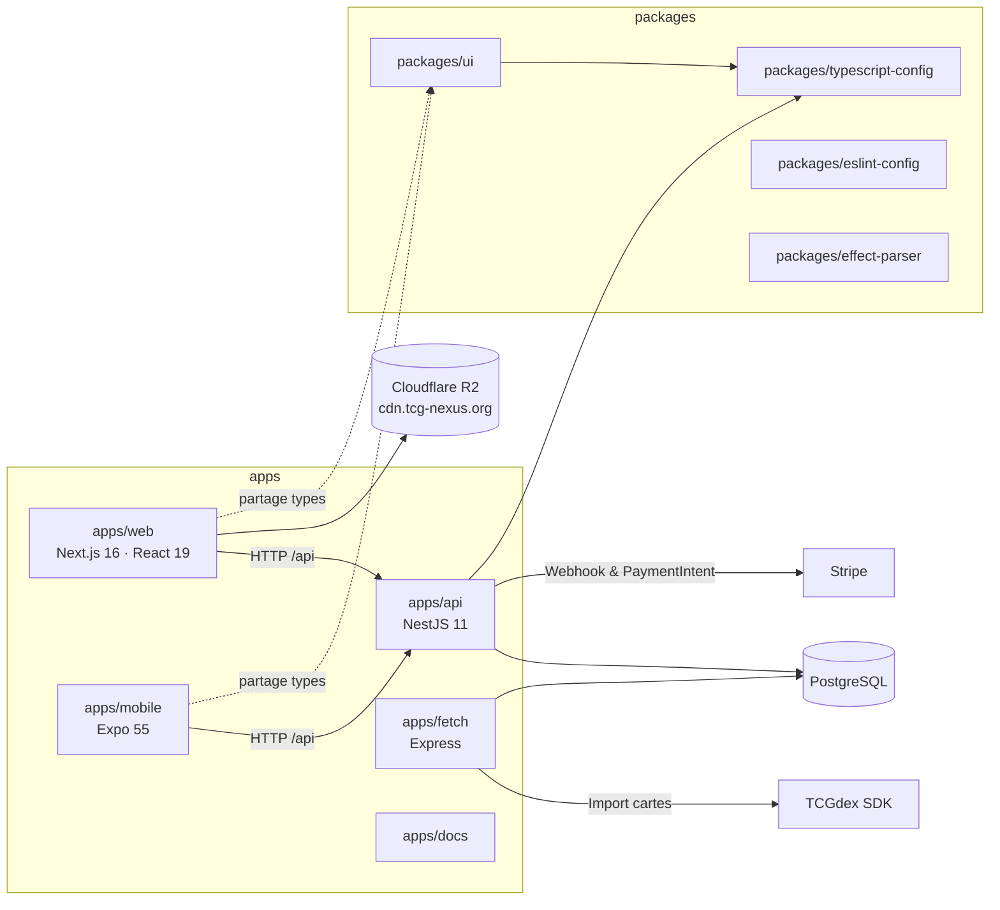
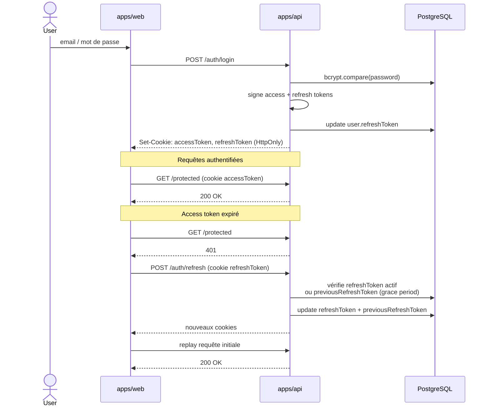
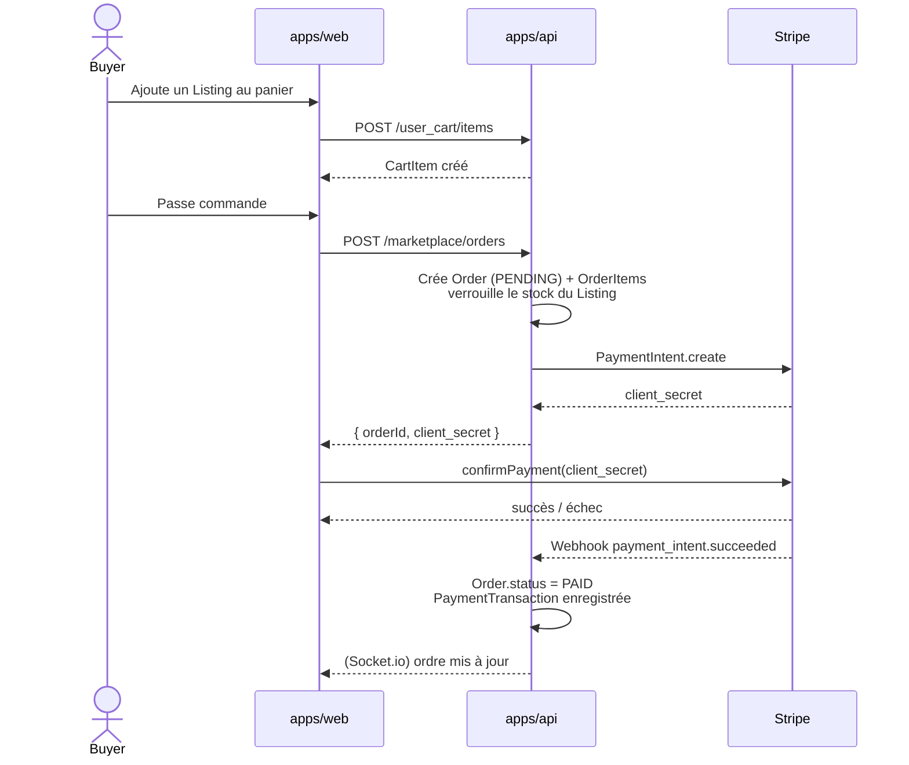

# Architecture technique — TCG Nexus

Document de référence décrivant l'organisation du code, les technologies retenues et les principaux flux applicatifs. Mis à jour au fur et à mesure de l'évolution du projet.

## 1. Vue d'ensemble

TCG Nexus est organisé en **monorepo Turborepo**. Un seul dépôt regroupe toutes les applications (web, API, mobile, microservice d'import) et les paquets partagés (UI, configs, parser). Turborepo est utilisé pour orchestrer les builds, tests et lints de façon incrémentale (cache de tâches).



## 2. Applications

| Application | Rôle | Stack principale |
|---|---|---|
| `apps/web` | Front utilisateur final | Next.js 16, React 19, Tailwind 4, Radix UI, React Query, Zustand |
| `apps/api` | API REST + WebSockets | NestJS 11, TypeORM 0.3, PostgreSQL, Passport-JWT, Stripe SDK |
| `apps/mobile` | Application mobile | Expo 55, React Native 0.79, Expo Router |
| `apps/fetch` | Microservice d'import de données cartes | Express, `@tcgdex/sdk` |
| `apps/docs` | Documentation technique (Next.js) | Next.js |

## 3. Organisation du backend (`apps/api`)

Le backend suit la structure classique d'un projet NestJS : un module par domaine métier, chacun exposant son `Module`, son `Controller`, son `Service`, ses `Entities` et ses DTOs.

**Modules métier** : `user`, `auth`, `pokemon-card`, `pokemon-set`, `pokemon-series`, `card`, `card-state`, `sealed-product`, `marketplace`, `user_cart`, `collection`, `collection-item`, `deck`, `deck-card`, `deck-format`, `tournament`, `match`, `player`, `ranking`, `challenge`, `badge`, `article`, `faq`, `search`, `statistics`, `dashboard`, `seed`, `ai`.

**Modules techniques** : `common` (enums, DTOs partagés), `helpers`, `scripts`.

Points notables :

- **Guard global** `JwtAuthGuard` appliqué via `APP_GUARD` — toutes les routes sont protégées par défaut. Les routes publiques doivent être marquées explicitement avec le décorateur `@Public()`.
- **Rôles** (`USER`, `MODERATOR`, `ADMIN`) via `@Roles()` + `RolesGuard`.
- **Validation** : `ValidationPipe` global avec `whitelist: true` et DTOs `class-validator`.
- **Erreurs** : `AllExceptionsFilter` standardise la forme des réponses d'erreur.
- **Throttling** : `ThrottlerModule` à 10 requêtes / 60 s par défaut (à durcir, cf. roadmap).
- **Base de données** : PostgreSQL via TypeORM. `synchronize` conditionné à `NODE_ENV` pour éviter toute altération automatique du schéma en production.

## 4. Organisation du frontend (`apps/web`)

Structure Next.js App Router :

```
apps/web/
├── app/
│   ├── (main)/          Routes publiques (home, pokemon, marketplace, tournaments, decks, collection, ...)
│   ├── (match)/         UI dédiée aux parties en cours (layout plein écran)
│   ├── (protected)/     Routes nécessitant une session authentifiée
│   ├── auth/            Login, register, reset password
│   ├── api/             Route handlers Next (proxys internes)
│   ├── layout.tsx       Layout racine (fonts, ThemeProvider, ClientProviders, metadata globale)
│   ├── sitemap.ts       Sitemap dynamique
│   ├── error.tsx        ErrorBoundary global
│   └── not-found.tsx    404 global
├── components/          Composants partagés (UI générique + sections par domaine)
├── contexts/            React Context (Auth, Theme, ...)
├── store/               Stores Zustand (cart, currency, match)
├── services/            Clients HTTP typés par domaine (pokemonCard.service, marketplace.service, ...)
├── hooks/               Hooks personnalisés
├── utils/               Helpers (fetch, images, variables d'env, ...)
└── types/               Types partagés côté front
```

**Gestion d'état** — séparation explicite :

- **Server state** (données issues de l'API) → `@tanstack/react-query`. Un seul `QueryClient` fourni via `ClientProviders`.
- **Client state global** (panier, devise préférée, état d'une partie) → Zustand.
- **Contexte applicatif** (utilisateur connecté, thème) → React Context.

**Communication avec l'API** :

- `utils/fetch.ts` expose `api` (public) et `secureApi` (avec cookies et intercepteur de refresh token).
- Chaque domaine a son service dans `services/` qui encapsule les appels.
- Les composants ne font jamais d'appel Axios direct, ils passent par un service + React Query.

## 5. Authentification

L'authentification repose sur un **JWT access token courte durée** + **refresh token rotatif** stocké côté serveur.



Points clés :

- Les tokens sont transportés en **cookies HttpOnly**, jamais accessibles depuis JavaScript.
- **Rotation avec période de grâce** : à chaque refresh, l'ancien refresh token est conservé dans `previousRefreshToken` pendant un court délai. Cela permet aux requêtes concurrentes (ex : onglet qui se réveille) de survivre sans déconnecter l'utilisateur, tout en restant résistant aux attaques de replay.
- Côté client, un **intercepteur Axios** sur `secureApi` capture les 401 et déclenche un refresh unique et partagé via une `refreshPromise` (mutex naturel). Les routes d'auth sont exclues du refresh automatique pour éviter les boucles.
- Le middleware Next.js gère le refresh côté navigation ; l'intercepteur gère le refresh côté requêtes XHR. Les deux sont complémentaires.

## 6. Flux d'achat marketplace



Points clés :

- La discriminaison entre carte unique et produit scellé se fait via `Listing.productKind` (enum `ProductKind`). Un listing a soit un `pokemonCard`, soit un `sealedProduct`, jamais les deux.
- Le paiement réel n'est validé **qu'au reçu du webhook Stripe** — pas la réponse du `confirmPayment` côté client (qui est informatif).
- Les statuts d'une `Order` suivent `PENDING → PAID → SHIPPED`, avec les états terminaux `CANCELLED` et `REFUNDED`.

## 7. Schéma de base de données

Voir [database-schema.md](./database-schema.md) pour le diagramme ER détaillé.

Les domaines sont :

- **Utilisateur** : `User`, `Player`, `UserBadge`, `Badge`.
- **Catalogue Pokémon** : `Card`, `PokemonCardDetails`, `PokemonSet`, `PokemonSerie`, `SealedProduct`, `SealedProductLocale`.
- **Marketplace** : `Listing`, `Order`, `OrderItem`, `PaymentTransaction`, `PriceHistory`, `CardPopularityMetrics`, `CardEvent`, `SealedEvent`.
- **Panier** : `UserCart`, `CartItem`.
- **Collection** : `Collection`, `CollectionItem`.
- **Decks** : `Deck`, `DeckCard`, `DeckFormat`, `SavedDeck`, `DeckShare`.
- **Compétitif** : `Tournament`, `TournamentRegistration`, `TournamentOrganizer`, `TournamentReward`, `TournamentPricing`, `TournamentNotification`, `RegistrationPayment`, `Match`, `CasualMatchSession`, `OnlineMatchSession`, `TrainingMatchSession`, `Ranking`, `Statistic`.
- **Contenus** : `Article`, `Faq`, `Challenge`, `UserChallenge`, `ActiveChallenge`.

## 8. Déploiement

Voir [deploiement-vm.md](./deploiement-vm.md) et [docker.md](./docker.md).

En résumé :

- **Production** : VM sous Docker + Cloudflare Tunnel. Le frontend est servi par `apps/web` sur `https://tcg-nexus.org`, l'API par `apps/api` sur `https://api.tcg-nexus.org`, les images de cartes par `cdn.tcg-nexus.org` (R2).
- **CI** : GitHub Actions (lint, type-check, tests backend, build).
- **Mirroring** : le repo est miroiré automatiquement (`.github/workflows/mirror.yml`).

## 9. Références croisées

- Décisions d'architecture → [adr/](./adr/)
- Schéma de données détaillé → [database-schema.md](./database-schema.md)
- Déploiement → [deploiement-vm.md](./deploiement-vm.md), [docker.md](./docker.md)
- Catalogue d'effets de cartes → [effect-types-catalog.md](./effect-types-catalog.md)
