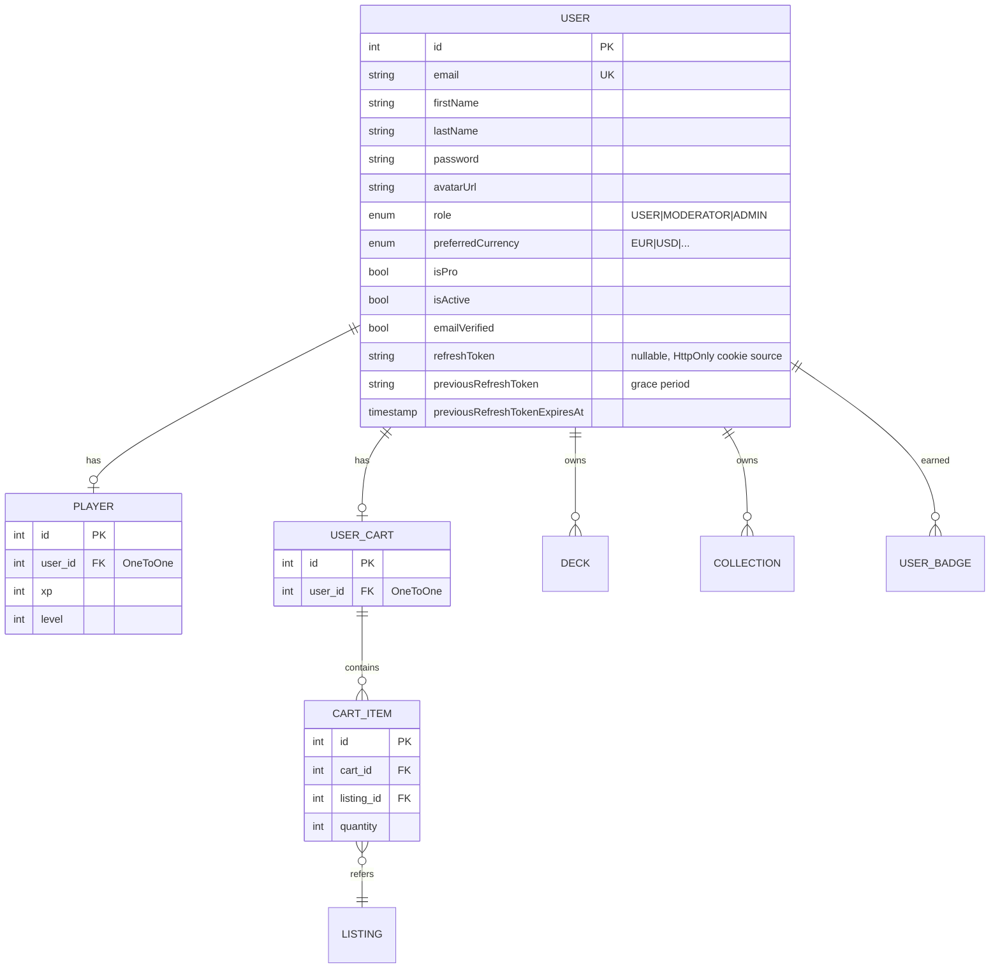
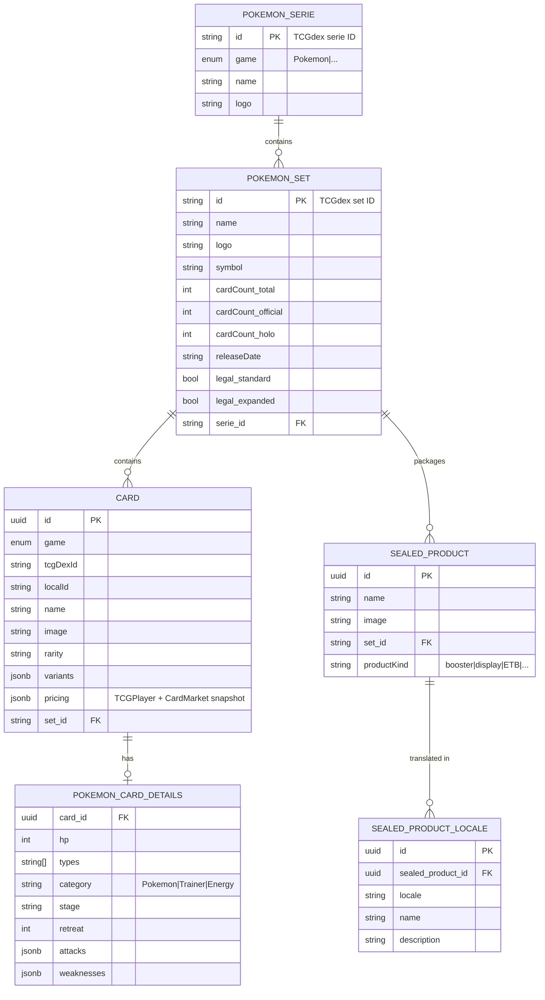
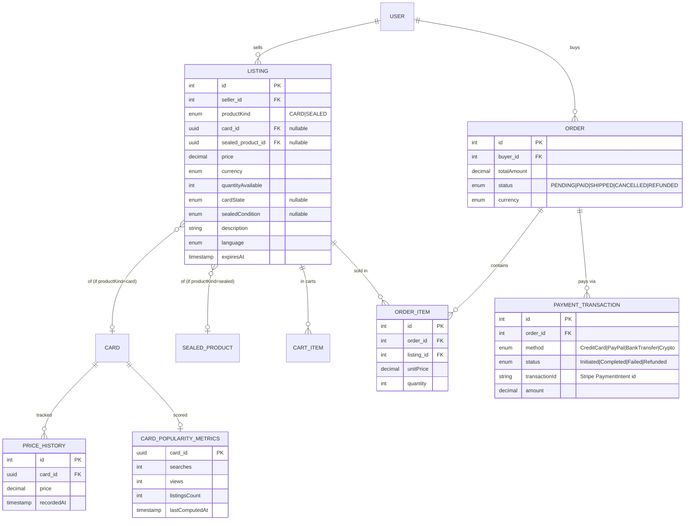
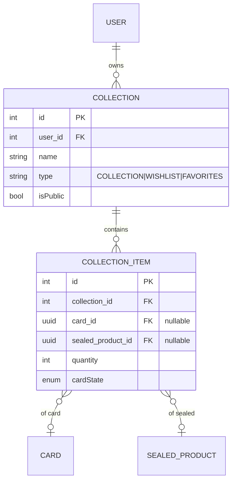
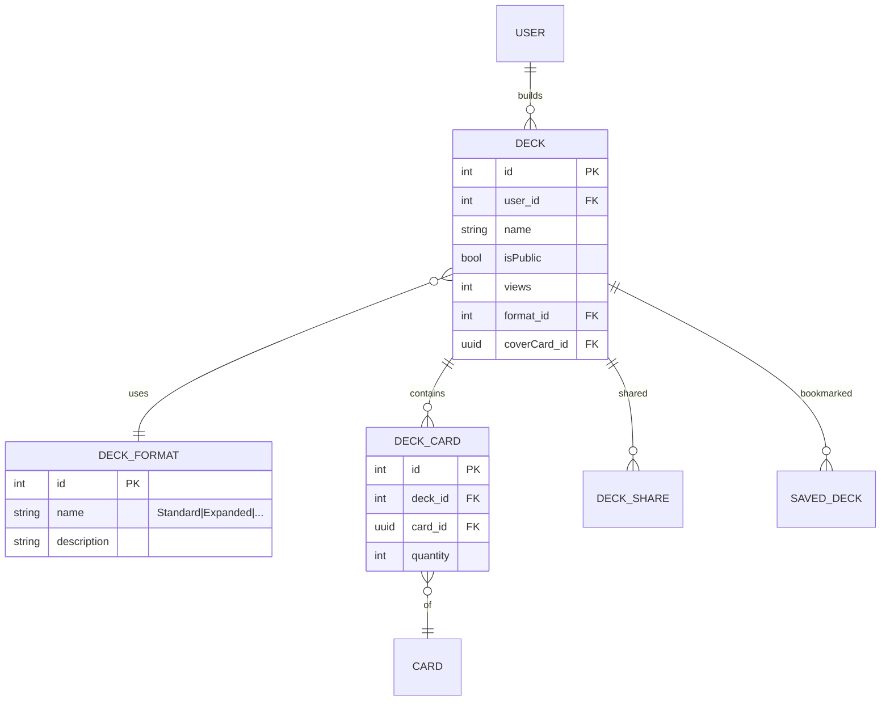
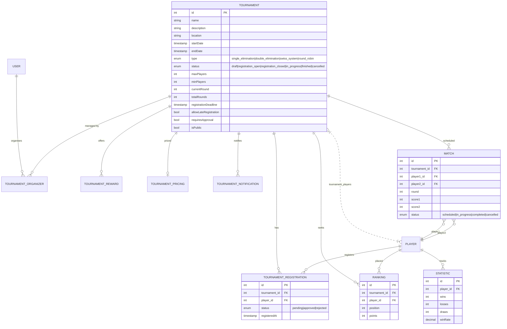

# Schéma de base de données

Ce document décrit le modèle relationnel utilisé par `apps/api` (PostgreSQL + TypeORM). Les diagrammes sont découpés par domaine pour rester lisibles. Les noms de tables et de colonnes reflètent les entités TypeORM ; certaines colonnes techniques peu informatives (`createdAt`, `updatedAt`, `deletedAt`) ne sont pas toujours représentées.

## 1. Utilisateur, joueur, panier

## 2. Catalogue cartes et produits scellés

Le catalogue est organisé en trois niveaux : **série** (ex : « Écarlate et Violet ») → **set** (ex : « 151 ») → **carte** individuelle. Les produits scellés (boosters, display, ETB) sont rattachés à un set.

## 3. Marketplace

Le cœur métier du projet. Un `Listing` vend **soit** une carte (`pokemonCard`), **soit** un produit scellé (`sealedProduct`), discriminé par `productKind`.

Indices importants sur `LISTING` (définis via `@Index` dans l'entité) :

- `price` (tri par prix)
- `(expiresAt, quantityAvailable)` (filtre des listings actifs)
- `(pokemonCard, currency, cardState)` (résolution rapide pour la page détail d'une carte)
- `(sealedProduct, currency)` (idem scellé)
- `productKind` (filtre discriminator)

## 4. Collection et wishlist

## 5. Decks

## 6. Compétition (tournois, matches, classements)

## 7. Contenus et gamification

- **`Article`** : actualités TCG, modèle simple (`title`, `content`, `author`, `publishedAt`).
- **`Faq`** : questions / réponses (`question`, `answer`, `category`).
- **`Challenge`**, **`UserChallenge`**, **`ActiveChallenge`** : objectifs dynamiques proposés à l'utilisateur.
- **`Badge`**, **`UserBadge`** : achievements.

Ces domaines sont peu couplés au reste du schéma et leurs entités sont lisibles directement dans `apps/api/src/*/entities/`.

## 8. Conventions

- Les clés primaires internes sont des entiers auto-incrémentés (`@PrimaryGeneratedColumn`), sauf pour les entités importées de TCGdex (sets, séries, cartes) qui gardent leur identifiant d'origine (`PrimaryColumn` string ou uuid).
- Les timestamps `createdAt` / `updatedAt` sont présents sur la plupart des entités via `@CreateDateColumn` / `@UpdateDateColumn`.
- `@DeleteDateColumn` est utilisé sur `Listing` pour permettre un soft-delete (préserver l'historique des ventes).
- Les enums sont stockés en type `enum` PostgreSQL, pas en `varchar`, pour contraindre les valeurs en base.
- Les relations multi-valuées sans attribut propre utilisent `@JoinTable` (ex : `tournament_players` entre `Tournament` et `Player`).

## 9. Comment régénérer ce diagramme

Les diagrammes sont maintenus à la main. À chaque évolution notable d'une entité :

1. Mettre à jour le bloc Mermaid concerné.
2. Ajouter une entrée dans le CHANGELOG du PR si la modification impacte la migration ou l'intégration client.
3. Envisager une migration TypeORM explicite (cf. [ADR-004](./adr/004-typeorm-synchronize.md)).
