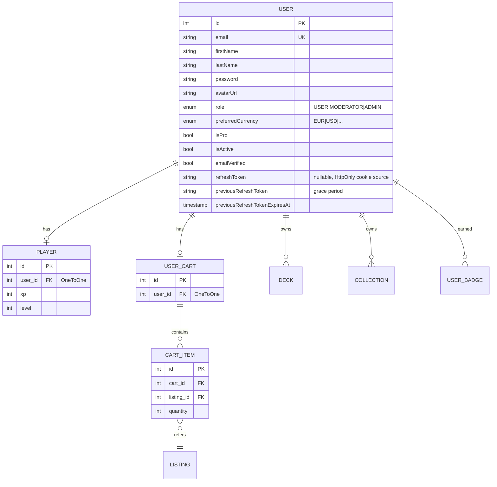
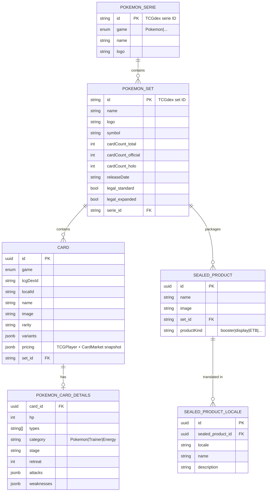
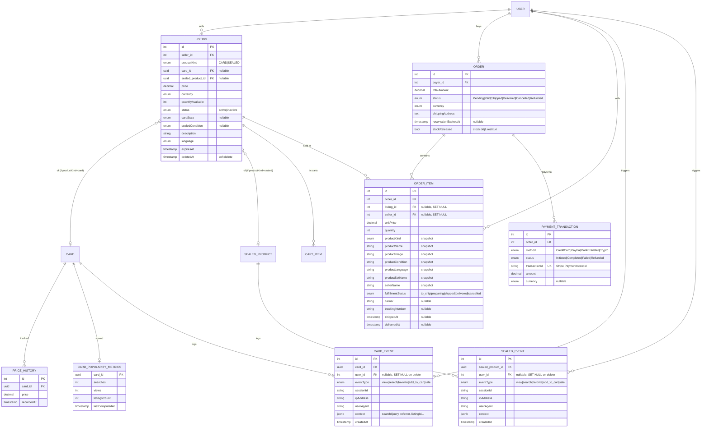
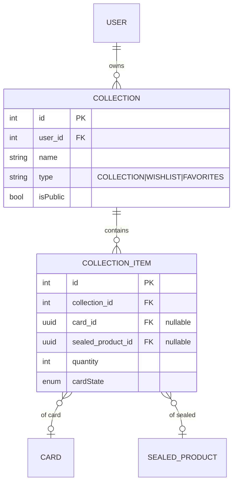
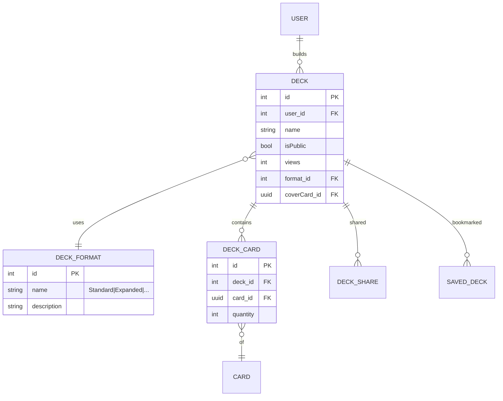
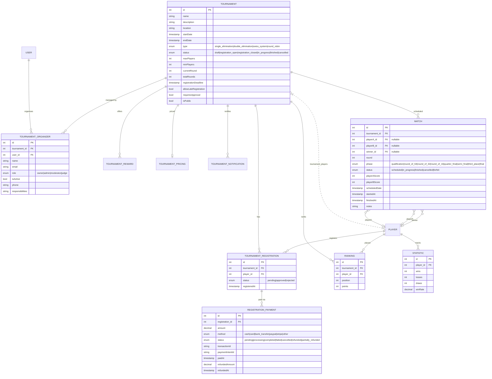
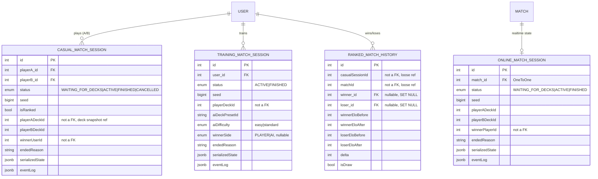
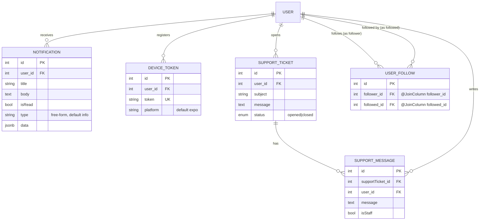

# Schéma de base de données

Ce document décrit le modèle relationnel utilisé par `apps/api` (PostgreSQL + TypeORM). Les diagrammes sont découpés par domaine pour rester lisibles. Les noms de tables et de colonnes reflètent les entités TypeORM ; certaines colonnes techniques peu informatives (`createdAt`, `updatedAt`, `deletedAt`) ne sont pas toujours représentées.

## 1. Utilisateur, joueur, panier

```mermaid
erDiagram
  USER ||--o| PLAYER : "has"
  USER ||--o| USER_CART : "has"
  USER ||--o{ DECK : "owns"
  USER ||--o{ COLLECTION : "owns"
  USER ||--o{ USER_BADGE : "earned"
  USER_CART ||--o{ CART_ITEM : "contains"
  CART_ITEM }o--|| LISTING : "refers"

  USER {
    int id PK
    string email UK
    string firstName
    string lastName
    string password
    string avatarUrl
    enum role "USER|MODERATOR|ADMIN"
    enum preferredCurrency "EUR|USD|..."
    bool isPro
    bool isActive
    bool emailVerified
    string refreshToken "nullable, HttpOnly cookie source"
    string previousRefreshToken "grace period"
    timestamp previousRefreshTokenExpiresAt
  }

  PLAYER {
    int id PK
    int user_id FK "OneToOne"
    int xp
    int level
  }

  USER_CART {
    int id PK
    int user_id FK "OneToOne"
  }

  CART_ITEM {
    int id PK
    int cart_id FK
    int listing_id FK
    int quantity
  }
```

## 2. Catalogue cartes et produits scellés

Le catalogue est organisé en trois niveaux : **série** (ex : « Écarlate et Violet ») → **set** (ex : « 151 ») → **carte** individuelle. Les produits scellés (boosters, display, ETB) sont rattachés à un set.

```mermaid
erDiagram
  POKEMON_SERIE ||--o{ POKEMON_SET : "contains"
  POKEMON_SET ||--o{ CARD : "contains"
  POKEMON_SET ||--o{ SEALED_PRODUCT : "packages"
  CARD ||--o| POKEMON_CARD_DETAILS : "has"
  SEALED_PRODUCT ||--o{ SEALED_PRODUCT_LOCALE : "translated in"

  POKEMON_SERIE {
    string id PK "TCGdex serie ID"
    enum game "Pokemon|..."
    string name
    string logo
  }

  POKEMON_SET {
    string id PK "TCGdex set ID"
    string name
    string logo
    string symbol
    int cardCount_total
    int cardCount_official
    int cardCount_holo
    string releaseDate
    bool legal_standard
    bool legal_expanded
    string serie_id FK
  }

  CARD {
    uuid id PK
    enum game
    string tcgDexId
    string localId
    string name
    string image
    string rarity
    jsonb variants
    jsonb pricing "TCGPlayer + CardMarket snapshot"
    string set_id FK
  }

  POKEMON_CARD_DETAILS {
    uuid card_id FK
    int hp
    string[] types
    string category "Pokemon|Trainer|Energy"
    string stage
    int retreat
    jsonb attacks
    jsonb weaknesses
  }

  SEALED_PRODUCT {
    uuid id PK
    string name
    string image
    string set_id FK
    string productKind "booster|display|ETB|..."
  }

  SEALED_PRODUCT_LOCALE {
    uuid id PK
    uuid sealed_product_id FK
    string locale
    string name
    string description
  }
```

## 3. Marketplace

Le cœur métier du projet. Un `Listing` vend **soit** une carte (`pokemonCard`), **soit** un produit scellé (`sealedProduct`), discriminé par `productKind`.

```mermaid
erDiagram
  USER ||--o{ LISTING : "sells"
  LISTING }o--o| CARD : "of (if productKind=card)"
  LISTING }o--o| SEALED_PRODUCT : "of (if productKind=sealed)"
  LISTING ||--o{ CART_ITEM : "in carts"
  LISTING ||--o{ ORDER_ITEM : "sold in"

  USER ||--o{ ORDER : "buys"
  USER ||--o{ ORDER_ITEM : "sells"
  ORDER ||--o{ ORDER_ITEM : "contains"
  ORDER ||--o{ PAYMENT_TRANSACTION : "pays via"

  CARD ||--o{ PRICE_HISTORY : "tracked"
  CARD ||--o| CARD_POPULARITY_METRICS : "scored"
  CARD ||--o{ CARD_EVENT : "logs"
  SEALED_PRODUCT ||--o{ SEALED_EVENT : "logs"
  USER ||--o{ CARD_EVENT : "triggers"
  USER ||--o{ SEALED_EVENT : "triggers"

  LISTING {
    int id PK
    int seller_id FK
    enum productKind "CARD|SEALED"
    uuid card_id FK "nullable"
    uuid sealed_product_id FK "nullable"
    decimal price
    enum currency
    int quantityAvailable
    enum status "active|inactive"
    enum cardState "nullable"
    enum sealedCondition "nullable"
    string description
    enum language
    timestamp expiresAt
    timestamp deletedAt "soft delete"
  }

  ORDER {
    int id PK
    int buyer_id FK
    decimal totalAmount
    enum status "Pending|Paid|Shipped|Delivered|Cancelled|Refunded"
    enum currency
    text shippingAddress
    timestamp reservationExpiresAt "nullable"
    bool stockReleased "stock déjà restitué"
  }

  ORDER_ITEM {
    int id PK
    int order_id FK
    int listing_id FK "nullable, SET NULL"
    int seller_id FK "nullable, SET NULL"
    decimal unitPrice
    int quantity
    enum productKind "snapshot"
    string productName "snapshot"
    string productImage "snapshot"
    string productCondition "snapshot"
    string productLanguage "snapshot"
    string productSetName "snapshot"
    string sellerName "snapshot"
    enum fulfillmentStatus "to_ship|preparing|shipped|delivered|cancelled"
    string carrier "nullable"
    string trackingNumber "nullable"
    timestamp shippedAt "nullable"
    timestamp deliveredAt "nullable"
  }

  PAYMENT_TRANSACTION {
    int id PK
    int order_id FK
    enum method "CreditCard|PayPal|BankTransfer|Crypto"
    enum status "Initiated|Completed|Failed|Refunded"
    string transactionId UK "Stripe PaymentIntent id"
    decimal amount
    enum currency "nullable"
  }

  PRICE_HISTORY {
    int id PK
    uuid card_id FK
    decimal price
    timestamp recordedAt
  }

  CARD_POPULARITY_METRICS {
    uuid card_id PK
    int searches
    int views
    int listingsCount
    timestamp lastComputedAt
  }

  CARD_EVENT {
    int id PK
    uuid card_id FK
    int user_id FK "nullable, SET NULL on delete"
    enum eventType "view|search|favorite|add_to_cart|sale"
    string sessionId
    string ipAddress
    string userAgent
    jsonb context "searchQuery, referrer, listingId..."
    timestamp createdAt
  }

  SEALED_EVENT {
    int id PK
    uuid sealed_product_id FK
    int user_id FK "nullable, SET NULL on delete"
    enum eventType "view|search|favorite|add_to_cart|sale"
    string sessionId
    string ipAddress
    string userAgent
    jsonb context
    timestamp createdAt
  }
```

`CardEvent` et `SealedEvent` alimentent `CardPopularityService` (tendances, best-sellers) ; ils sont volontairement dénormalisés (pas de relation vers `Listing`) pour rester rapides à écrire sur le hot path des pages de consultation.

Indices importants sur `LISTING` (définis via `@Index` dans l'entité) :

- `price` (tri par prix)
- `(expiresAt, quantityAvailable)` (filtre des listings actifs)
- `(pokemonCard, currency, cardState)` (résolution rapide pour la page détail d'une carte)
- `(sealedProduct, currency)` (idem scellé)
- `productKind` (filtre discriminator)

Points de conception côté commandes :

- `ORDER_ITEM` recopie le produit et le vendeur au moment de l'achat (colonnes `product*`, `sellerName`). Les clés `listing_id` et `seller_id` sont donc nullables avec `ON DELETE SET NULL` : la suppression d'une annonce ou d'un compte ne détruit pas l'historique d'achat.
- `transactionId` est en index **unique** : un webhook Stripe rejoué ne peut pas créer une seconde transaction pour le même `PaymentIntent`.
- `stockReleased` garantit que le stock réservé n'est restitué qu'une seule fois, quel que soit le nombre de déclencheurs d'annulation (webhook, cron d'expiration, action admin).

## 4. Collection et wishlist

```mermaid
erDiagram
  USER ||--o{ COLLECTION : "owns"
  COLLECTION ||--o{ COLLECTION_ITEM : "contains"
  COLLECTION_ITEM }o--o| CARD : "of card"
  COLLECTION_ITEM }o--o| SEALED_PRODUCT : "of sealed"

  COLLECTION {
    int id PK
    int user_id FK
    string name
    string type "COLLECTION|WISHLIST|FAVORITES"
    bool isPublic
  }

  COLLECTION_ITEM {
    int id PK
    int collection_id FK
    uuid card_id FK "nullable"
    uuid sealed_product_id FK "nullable"
    int quantity
    enum cardState
  }
```

## 5. Decks

```mermaid
erDiagram
  USER ||--o{ DECK : "builds"
  DECK }o--|| DECK_FORMAT : "uses"
  DECK ||--o{ DECK_CARD : "contains"
  DECK_CARD }o--|| CARD : "of"
  DECK ||--o{ DECK_SHARE : "shared"
  DECK ||--o{ SAVED_DECK : "bookmarked"

  DECK {
    int id PK
    int user_id FK
    string name
    bool isPublic
    int views
    int format_id FK
    uuid coverCard_id FK
  }

  DECK_FORMAT {
    int id PK
    string name "Standard|Expanded|..."
    string description
  }

  DECK_CARD {
    int id PK
    int deck_id FK
    uuid card_id FK
    int quantity
  }
```

## 6. Compétition (tournois, matches, classements)

```mermaid
erDiagram
  USER ||--o{ TOURNAMENT_ORGANIZER : "organises"
  TOURNAMENT ||--o{ TOURNAMENT_ORGANIZER : "managed by"
  TOURNAMENT ||--o{ TOURNAMENT_REGISTRATION : "has"
  TOURNAMENT ||--o{ TOURNAMENT_REWARD : "offers"
  TOURNAMENT ||--o| TOURNAMENT_PRICING : "priced"
  TOURNAMENT ||--o{ TOURNAMENT_NOTIFICATION : "notifies"
  TOURNAMENT ||--o{ MATCH : "scheduled"
  TOURNAMENT ||--o{ RANKING : "ranks"
  TOURNAMENT }|..|{ PLAYER : "tournament_players"
  PLAYER ||--o{ TOURNAMENT_REGISTRATION : "registers"
  PLAYER ||--o{ RANKING : "placed"
  PLAYER ||--o{ STATISTIC : "tracks"
  TOURNAMENT_REGISTRATION ||--o{ REGISTRATION_PAYMENT : "paid via"
  MATCH }o--o| PLAYER : "playerA"
  MATCH }o--o| PLAYER : "playerB"
  MATCH }o--o| PLAYER : "winner"

  TOURNAMENT {
    int id PK
    string name
    string description
    string location
    timestamp startDate
    timestamp endDate
    enum type "single_elimination|double_elimination|swiss_system|round_robin"
    enum status "draft|registration_open|registration_closed|in_progress|finished|cancelled"
    int maxPlayers
    int minPlayers
    int currentRound
    int totalRounds
    timestamp registrationDeadline
    bool allowLateRegistration
    bool requiresApproval
    bool isPublic
  }

  TOURNAMENT_ORGANIZER {
    int id PK
    int tournament_id FK
    int user_id FK
    string name
    string email
    enum role "owner|admin|moderator|judge"
    bool isActive
    string phone
    string responsibilities
  }

  TOURNAMENT_REGISTRATION {
    int id PK
    int tournament_id FK
    int player_id FK
    enum status "pending|approved|rejected"
    timestamp registeredAt
  }

  REGISTRATION_PAYMENT {
    int id PK
    int registration_id FK
    decimal amount
    enum method "cash|card|bank_transfer|paypal|stripe|other"
    enum status "pending|processing|completed|failed|cancelled|refunded|partially_refunded"
    string transactionId
    string paymentIntentId
    timestamp paidAt
    decimal refundedAmount
    timestamp refundedAt
  }

  MATCH {
    int id PK
    int tournament_id FK
    int playerA_id FK "nullable"
    int playerB_id FK "nullable"
    int winner_id FK "nullable"
    int round
    enum phase "qualification|round_of_64|round_of_32|round_of_16|quarter_final|semi_final|third_place|final"
    enum status "scheduled|in_progress|finished|cancelled|forfeit"
    int playerAScore
    int playerBScore
    timestamp scheduledDate
    timestamp startedAt
    timestamp finishedAt
    string notes
  }

  RANKING {
    int id PK
    int tournament_id FK
    int player_id FK
    int position
    int points
  }

  STATISTIC {
    int id PK
    int player_id FK
    int wins
    int losses
    int draws
    decimal winRate
  }
```

`Match` porte aussi une relation `OneToOne` vers `OnlineMatchSession` (état temps réel de la partie, cf. section suivante) et une relation `OneToMany` vers `Statistics`.

## 7. Sessions de match temps réel et historique classé

Le moteur de jeu temps réel (casual, en ligne, entraînement) stocke son état dans des tables dédiées, séparées de `Match` (qui reste le modèle "tournoi"). `serializedState` et `eventLog` portent l'état du moteur de jeu (cf. `match.gateway.ts`) et ne sont pas normalisés en base.

```mermaid
erDiagram
  USER ||--o{ CASUAL_MATCH_SESSION : "plays (A/B)"
  USER ||--o{ TRAINING_MATCH_SESSION : "trains"
  MATCH ||--o| ONLINE_MATCH_SESSION : "realtime state"
  USER ||--o{ RANKED_MATCH_HISTORY : "wins/loses"

  CASUAL_MATCH_SESSION {
    int id PK
    int playerA_id FK
    int playerB_id FK
    enum status "WAITING_FOR_DECKS|ACTIVE|FINISHED|CANCELLED"
    bigint seed
    bool isRanked
    int playerADeckId "not a FK, deck snapshot ref"
    int playerBDeckId
    int winnerUserId "not a FK"
    string endedReason
    jsonb serializedState
    jsonb eventLog
  }

  ONLINE_MATCH_SESSION {
    int id PK
    int match_id FK "OneToOne"
    enum status "WAITING_FOR_DECKS|ACTIVE|FINISHED"
    bigint seed
    int playerADeckId
    int playerBDeckId
    int winnerPlayerId "not a FK"
    string endedReason
    jsonb serializedState
    jsonb eventLog
  }

  TRAINING_MATCH_SESSION {
    int id PK
    int user_id FK
    enum status "ACTIVE|FINISHED"
    bigint seed
    int playerDeckId "not a FK"
    string aiDeckPresetId
    enum aiDifficulty "easy|standard"
    enum winnerSide "PLAYER|AI, nullable"
    string endedReason
    jsonb serializedState
    jsonb eventLog
  }

  RANKED_MATCH_HISTORY {
    int id PK
    int casualSessionId "not a FK, loose ref"
    int matchId "not a FK, loose ref"
    int winner_id FK "nullable, SET NULL"
    int loser_id FK "nullable, SET NULL"
    int winnerEloBefore
    int winnerEloAfter
    int loserEloBefore
    int loserEloAfter
    int delta
    bool isDraw
  }
```

`RankedMatchHistory.casualSessionId` / `matchId` sont des références "molles" (pas de `@ManyToOne`) vers la partie source, gardées même si la session/partie est purgée, pour préserver l'historique ELO.

## 8. Notifications, support et social

```mermaid
erDiagram
  USER ||--o{ NOTIFICATION : "receives"
  USER ||--o{ DEVICE_TOKEN : "registers"
  USER ||--o{ SUPPORT_TICKET : "opens"
  SUPPORT_TICKET ||--o{ SUPPORT_MESSAGE : "has"
  USER ||--o{ SUPPORT_MESSAGE : "writes"
  USER ||--o{ USER_FOLLOW : "follows (as follower)"
  USER ||--o{ USER_FOLLOW : "followed by (as followed)"

  NOTIFICATION {
    int id PK
    int user_id FK
    string title
    text body
    bool isRead
    string type "free-form, default info"
    jsonb data
  }

  DEVICE_TOKEN {
    int id PK
    int user_id FK
    string token UK
    string platform "default expo"
  }

  SUPPORT_TICKET {
    int id PK
    int user_id FK
    string subject
    text message
    enum status "opened|closed"
  }

  SUPPORT_MESSAGE {
    int id PK
    int supportTicket_id FK
    int user_id FK
    text message
    bool isStaff
  }

  USER_FOLLOW {
    int id PK
    int follower_id FK "@JoinColumn follower_id"
    int followed_id FK "@JoinColumn followed_id"
  }
```

Index unique composite `(follower, followed)` sur `UserFollow` pour empêcher les doublons de suivi.

## 9. Contenus et gamification

- **`Article`** : actualités TCG, modèle simple (`title`, `content`, `author`, `publishedAt`).
- **`Faq`** : questions / réponses (`question`, `answer`, `category`).
- **`Challenge`**, **`UserChallenge`**, **`ActiveChallenge`** : objectifs dynamiques proposés à l'utilisateur.
- **`Badge`**, **`UserBadge`** : achievements.

Ces domaines sont peu couplés au reste du schéma et leurs entités sont lisibles directement dans `apps/api/src/*/entities/`.

## 10. Conventions

- Les clés primaires internes sont des entiers auto-incrémentés (`@PrimaryGeneratedColumn`), sauf pour les entités importées de TCGdex (sets, séries, cartes) qui gardent leur identifiant d'origine (`PrimaryColumn` string ou uuid).
- Les timestamps `createdAt` / `updatedAt` sont présents sur la plupart des entités via `@CreateDateColumn` / `@UpdateDateColumn`.
- `@DeleteDateColumn` est utilisé sur `Listing` pour permettre un soft-delete (préserver l'historique des ventes).
- Les enums sont stockés en type `enum` PostgreSQL, pas en `varchar`, pour contraindre les valeurs en base.
- Les relations multi-valuées sans attribut propre utilisent `@JoinTable` (ex : `tournament_players` entre `Tournament` et `Player`).

## 11. Comment régénérer ce diagramme

Les diagrammes sont maintenus à la main. À chaque évolution notable d'une entité :

1. Mettre à jour le bloc Mermaid concerné.
2. Ajouter une entrée dans le CHANGELOG du PR si la modification impacte la migration ou l'intégration client.
3. Envisager une migration TypeORM explicite (cf. [ADR-004](./adr/004-typeorm-synchronize.md)).
