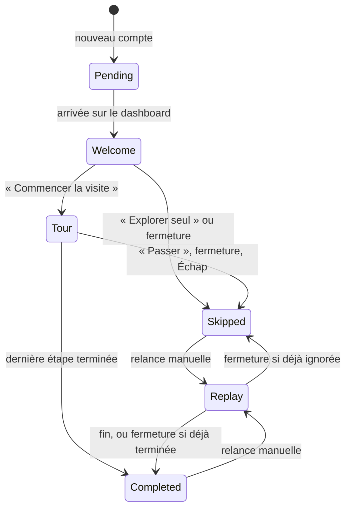

# Plan — Onboarding après inscription

Date : 2026-09-10

Périmètre initial : application web (`apps/web`) et persistance utilisateur dans l'API (`apps/api`).

Hors périmètre du premier lot : onboarding mobile natif et analytics produit avancées.

## 1. Objectif produit

Après la création d'un compte, présenter en moins d'une minute les fonctionnalités
phares de TCG Nexus, sans bloquer l'utilisateur :

- comprendre le rôle du dashboard et de la recherche globale ;
- découvrir la collection et les Master Sets ;
- trouver, créer et analyser des decks ;
- découvrir le jeu, les tournois et les mini-jeux ;
- parcourir, acheter et vendre sur la marketplace ;
- pouvoir ignorer la visite à tout moment et la relancer plus tard.

Le premier lot prend la forme d'un écran de bienvenue suivi d'un tour guidé avec
[Driver.js](https://driverjs.com/). La visite reste sur le dashboard et met en
évidence les entrées de navigation qui donnent accès aux fonctionnalités. Elle ne
navigue pas automatiquement de page en page : cela rend le parcours plus court,
évite de perdre son état pendant les transitions Next.js et limite sa fragilité
face aux données asynchrones.

## 2. État actuel pertinent

- L'inscription classique appelle `AuthContext.register`, puis redirige aujourd'hui
  vers `/`.
- L'inscription Google revient déjà par défaut sur `/dashboard`, mais le callback
  OAuth ne distingue pas encore dans sa réponse un compte nouvellement créé d'un
  compte existant.
- Le layout principal commun est `SidebarLayout`; il contient `AppSidebar` et
  `TopBar`. C'est le bon niveau pour monter un orchestrateur d'onboarding unique.
- Les destinations à présenter existent dans `utils/sidebar.ts` : dashboard,
  collection, decks, jeu, tournois, marketplace, paramètres et FAQ.
- Le backend possède un `UserJourneyService`, mais il calcule les prochaines
  actions métier (commande, deck, tournoi). Il ne doit pas porter l'état du tour
  produit ; les deux notions ont des cycles de vie différents.
- Le projet est localisé en français et en anglais avec `next-intl` et vérifie déjà
  la parité des dictionnaires par test.

## 3. Parcours cible



### 3.1 Déclenchement automatique

1. Après inscription par formulaire, rediriger vers `/dashboard`.
2. Après inscription Google, conserver le retour par défaut vers `/dashboard`.
3. Une fois l'authentification et le layout hydratés, charger l'état d'onboarding.
4. Afficher l'écran de bienvenue uniquement si la version courante n'a jamais été
   traitée par cet utilisateur.
5. Se baser sur l'état persistant, pas sur la date du compte ni sur le type de
   connexion. Les utilisateurs existants sont marqués comme déjà onboardés par la
   migration ; un nouveau compte resté `pending` peut reprendre le parcours lors
   d'une connexion ultérieure.

### 3.2 Écran de bienvenue

Dialogue accessible et responsive contenant :

- « Bienvenue sur TCG Nexus, {firstName} » ;
- une promesse courte : collectionner, construire, jouer et échanger au même endroit ;
- un aperçu visuel des cinq familles de fonctionnalités ;
- action principale « Commencer la visite (1 min) » ;
- action secondaire bien visible « Explorer par moi-même » ;
- fermeture par croix et touche Échap, équivalente à un skip.

### 3.3 Étapes du tour Driver.js

Limiter le tour à sept étapes, avec un texte court et une seule idée par étape :

| Étape | Cible desktop | Message |
|---|---|---|
| 1 | en-tête du dashboard | Le dashboard centralise l'activité, la collection et les prochaines actions. |
| 2 | recherche globale | Retrouver rapidement une carte, un joueur, un deck ou un produit. |
| 3 | navigation Collection | Suivre ses cartes, favoris, wishlist et Master Sets. |
| 4 | navigation Decks | Créer/importer un deck et utiliser l'analyse de deck. |
| 5 | navigations Jouer et Tournois | Jouer, s'entraîner, participer à des tournois et découvrir les mini-jeux. |
| 6 | navigation Marketplace | Parcourir les prix, acheter et mettre ses cartes en vente. |
| 7 | navigation Aide/Paramètres | Personnaliser le compte et relancer cette visite à tout moment. |

Chaque popover expose « Précédent », « Suivant », la progression, une fermeture
et un bouton textuel « Passer la visite ». La dernière étape propose « Terminer »
et renvoie l'utilisateur sur le dashboard sans autre redirection.

Sur mobile, ne pas ouvrir le `Sheet` de la sidebar sous l'overlay Driver.js. Utiliser
une variante compacte composée de popovers centrés, sans cible DOM pour les
fonctionnalités absentes de la barre supérieure. Le contenu et la progression
restent identiques ; la visite desktop conserve les mises en évidence visuelles.

### 3.4 Relance manuelle

Ajouter une entrée « Visite guidée » dans le groupe Aide pour les utilisateurs
connectés et un bouton « Revoir la visite guidée » dans les paramètres. Les deux
redirigent si nécessaire vers `/dashboard?tour=1`. L'orchestrateur démarre le tour
après rendu des cibles, puis retire le paramètre de l'URL pour éviter une relance
au refresh.

Une visite relancée ne modifie pas l'état persistant si elle est simplement
fermée. Si elle est menée au bout, son état devient `completed`, y compris si la
première visite avait été ignorée.

## 4. Architecture technique

### 4.1 Persistance API

Ajouter sur `User` :

- `onboardingVersion: number` ;
- `onboardingStatus: "pending" | "completed" | "skipped"` ;
- `onboardingUpdatedAt: Date | null`.

La version initiale du tour est une constante partagée conceptuellement entre le
front et l'API : `CURRENT_ONBOARDING_VERSION = 1`. Une montée de version ne doit
être faite que si une nouvelle visite mérite réellement d'être reproposée.

La migration doit préserver les utilisateurs actuels :

1. créer les colonnes sans `NOT NULL` ;
2. renseigner les comptes existants avec version `1` et statut `completed` ;
3. poser les valeurs par défaut des nouveaux comptes : version `0`, statut
   `pending` ;
4. ajouter les contraintes `NOT NULL` sur la version et le statut.

Ainsi, les créations classiques et OAuth héritent du même état sans modifier les
contrats de réponse de l'authentification.

Créer des endpoints dédiés, authentifiés :

```text
GET   /users/me/onboarding
PATCH /users/me/onboarding
```

Réponse du `GET` :

```json
{
  "version": 0,
  "status": "pending",
  "updatedAt": null
}
```

Payload du `PATCH` :

```json
{
  "version": 1,
  "status": "completed"
}
```

Le DTO accepte seulement `completed` ou `skipped`, refuse une version supérieure
à celle supportée par l'API et écrit la date côté serveur. L'état ne doit pas être
ajouté à `UpdateMyProfileDto`, afin de conserver une séparation claire entre les
préférences de profil et le cycle de vie de l'onboarding.

Fichiers principaux :

- `apps/api/src/user/entities/user.entity.ts` ;
- `apps/api/src/user/dto/update-onboarding.dto.ts` ;
- `apps/api/src/user/dto/onboarding-state.dto.ts` ;
- `apps/api/src/user/user.service.ts` ;
- `apps/api/src/user/user.controller.ts` ;
- nouvelle migration TypeORM.

### 4.2 Orchestration web

Créer un domaine autonome `components/Onboarding/` :

- `OnboardingProvider.tsx` : charge l'état, arbitre lancement automatique ou manuel,
  empêche les doubles lancements React Strict Mode et expose `startTour()` ;
- `OnboardingWelcomeDialog.tsx` : écran de bienvenue ;
- `ProductTour.tsx` ou `createProductTour.ts` : configuration et cycle de vie
  Driver.js ;
- `tourSteps.ts` : définition typée des étapes desktop/mobile ;
- `onboarding.css` : thème TCG Nexus clair/sombre, focus et responsive.

Ajouter également :

- `services/onboarding.service.ts` et `types/onboarding.ts` pour le contrat API ;
- le provider à l'intérieur de `SidebarProvider` dans `SidebarLayout`, afin qu'il
  puisse déplier temporairement la sidebar desktop via `useSidebar()` ;
- des ancres stables `data-onboarding="..."` sur les composants ciblés. Ne pas
  utiliser de sélecteurs basés sur les classes Tailwind ou sur le texte traduit ;
- les clés `Onboarding.*` dans `messages/fr.json` et `messages/en.json` ;
- l'entrée de relance dans `AppSidebar` et le bouton des paramètres.

La sidebar desktop doit retrouver son état initial à la fin du tour. Sur mobile,
la liste d'étapes sans cible évite de modifier `openMobile`.

### 4.3 Intégration Driver.js

Ajouter `driver.js` à la workspace web en version verrouillée sur la version testée
(version courante vérifiée lors de ce plan : `1.8.0`). Importer son CSS officiel,
puis le surcharger sous une classe `tcg-onboarding-popover` pour respecter les
tokens du thème existant.

Configuration recommandée :

```ts
driver({
  allowClose: true,
  allowKeyboardControl: true,
  overlayClickBehavior: "close",
  showProgress: true,
  smoothScroll: true,
  skipMissingElement: true,
  popoverClass: "tcg-onboarding-popover",
  // Textes, étapes et callbacks localisés.
});
```

Utiliser `onPopoverRender` pour injecter une action « Passer la visite » accessible
et idempotente dans le footer. Utiliser `onDoneClick` pour enregistrer la fin puis
appeler `destroy()`, et `onCloseClick` pour enregistrer le skip lors du parcours
automatique. Ne pas persister directement depuis `onDestroyed` : ce callback sert
aussi au nettoyage normal après une complétion.

Pour les widgets ou cibles rendus de façon asynchrone, utiliser `waitForElement`
avec un délai borné, puis `skipMissingElement` comme repli. Respecter
`prefers-reduced-motion` en désactivant `animate` lorsque nécessaire.

La documentation officielle confirme l'import npm/CSS, les étapes typées, les
callbacks, les boutons personnalisés et l'attente de cibles :
[installation](https://driverjs.com/docs/installation),
[configuration](https://driverjs.com/docs/configuration),
[API](https://driverjs.com/docs/api) et
[tours asynchrones](https://driverjs.com/docs/async-tour).

### 4.4 Gestion des erreurs

- Si le `GET` d'état échoue, ne pas interrompre la navigation et ne pas lancer
  automatiquement le dialogue. La relance manuelle reste disponible.
- Si le `PATCH` de fin/skip échoue, fermer tout de même l'UI, afficher un toast
  discret et garder un verrou en mémoire pour ne pas relancer dans la même session.
  L'API sera retentée lors d'une future session.
- Détruire systématiquement l'instance Driver au démontage ou à la déconnexion
  afin de retirer overlay, listeners et classes globales.
- Ne jamais démarrer deux instances en parallèle lors d'un changement rapide de
  route ou d'un double effet en développement.

## 5. Phases d'implémentation

### Phase 1 — Contrat et persistance (1 jour)

1. Ajouter les colonnes et la migration avec backfill des comptes existants.
2. Ajouter enum/types, DTOs, service et endpoints `GET/PATCH`.
3. Couvrir validation, lecture, complétion et skip par tests API.
4. Vérifier explicitement la création classique et OAuth avec l'état `pending`.

Critère de sortie : un nouveau compte retourne `pending/0`, un compte existant
reste silencieux, et une décision est conservée après reconnexion.

### Phase 2 — Déclenchement et écran de bienvenue (1 jour)

1. Rediriger l'inscription classique vers `/dashboard`.
2. Ajouter service, types et provider web.
3. Construire le dialogue responsive avec les deux actions visibles.
4. Ajouter i18n FR/EN et gestion des erreurs.

Critère de sortie : le dialogue apparaît une seule fois après toute méthode
d'inscription et peut être ignoré sans bloquer le dashboard.

### Phase 3 — Tour Driver.js desktop/mobile (1 à 1,5 jour)

1. Installer Driver.js et ajouter le thème visuel.
2. Poser les ancres `data-onboarding` stables.
3. Définir les sept étapes et les callbacks de résultat.
4. Gérer sidebar réduite, cibles asynchrones, variante mobile et reduced motion.
5. Vérifier mode clair, sombre, clavier et petits écrans.

Critère de sortie : le tour est complet, skippable depuis chaque étape et ne laisse
aucun overlay après fermeture, logout ou changement de route.

### Phase 4 — Relance et durcissement (0,5 à 1 jour)

1. Ajouter les deux points de relance (Aide et Paramètres).
2. Gérer `/dashboard?tour=1` et nettoyer l'URL.
3. Restaurer l'état antérieur de la sidebar.
4. Finaliser tests, documentation et vérifications de non-régression.

Critère de sortie : un utilisateur ayant terminé ou ignoré le tour peut toujours
le relancer et le terminer, sans qu'il réapparaisse automatiquement ensuite.

Estimation totale : **3,5 à 4,5 jours de développement**, puis **0,5 à 1 jour de
recette** selon le niveau de couverture navigateur souhaité.

## 6. Stratégie de tests

### API

- migration : anciens comptes complétés, nouveaux comptes en attente ;
- `GET /users/me/onboarding` authentifié ;
- `PATCH` completed/skipped, date serveur et version valide ;
- rejet de `pending`, d'un statut inconnu et d'une version future ;
- non-régression des inscriptions formulaire et OAuth.

### Web (Vitest + Testing Library)

- lancement automatique uniquement pour `pending` et uniquement une fois ;
- absence de lancement pour `completed`, `skipped`, utilisateur anonyme ou erreur
  réseau ;
- skip depuis le dialogue et depuis le tour ;
- complétion de la dernière étape ;
- relance manuelle sans réinitialisation intempestive ;
- nettoyage au logout/démontage ;
- variante mobile et disparition d'une cible ;
- parité de toutes les nouvelles clés FR/EN.

### Recette manuelle

- formulaire et Google OAuth ;
- Chrome/Firefox/Safari, desktop et largeur mobile ;
- thèmes clair/sombre et `prefers-reduced-motion` ;
- navigation clavier : Tab, Entrée, Échap ;
- refresh, reconnexion et relance depuis Aide/Paramètres ;
- simulation d'un échec des endpoints d'état.

## 7. Critères d'acceptation

- Tout nouveau compte web voit une invitation à découvrir TCG Nexus sur le
  dashboard après inscription classique ou OAuth.
- L'utilisateur peut ignorer l'onboarding dès l'écran de bienvenue et pendant
  chacune des étapes du tour.
- Le parcours comporte au maximum sept étapes et prend environ une minute.
- Une complétion ou un skip survit au refresh, à la reconnexion et au changement
  d'appareil.
- Les comptes créés avant le déploiement ne voient aucun onboarding automatique.
- La visite est relançable depuis l'Aide et les Paramètres.
- Le tour fonctionne en français et en anglais, en thème clair/sombre et au clavier.
- Une cible absente ou une panne de persistance n'empêche jamais d'utiliser le site.
- `npm run check-types`, les tests API concernés et la suite web passent sans erreur.

## 8. Décisions assumées

- **Persistance serveur plutôt que `localStorage`** : indispensable pour la
  cohérence multi-appareil et pour ne pas confondre deux utilisateurs d'un même
  navigateur.
- **Tour mono-page** : le tour présente les capacités sans piloter des actions
  métier ni dépendre de données de collection, de deck ou de marketplace.
- **Comptes existants exclus du lancement automatique** : l'onboarding accompagne
  l'inscription sans interrompre les utilisateurs actuels.
- **Mobile natif différé** : le contrat backend pourra être réutilisé plus tard,
  mais Driver.js ne concerne que le web.
- **Pas d'analytics dédiées dans le MVP** : `status`, `version` et `updatedAt`
  suffisent au fonctionnement. Des événements `started/skipped/completed` pourront
  être ajoutés quand un outil de mesure produit sera choisi.
